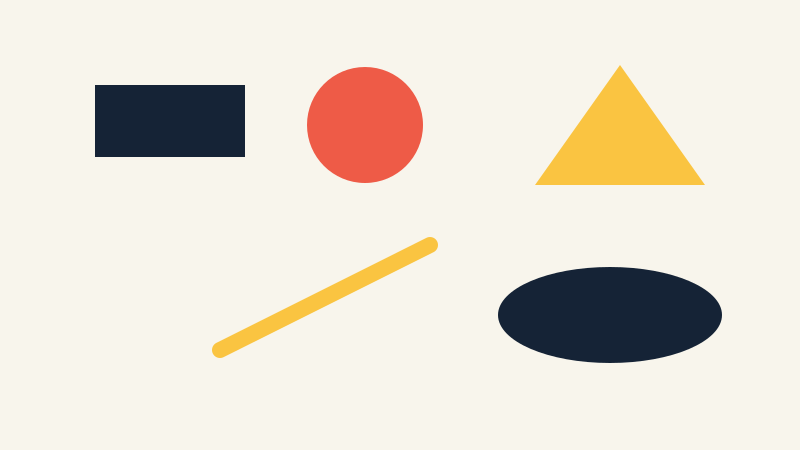

# Cross-platform setup and the first frame

This section has one path: learn how a frame is built, practice with a known-good
window, then solve one tested visual problem. Do the three parts in order.

1. [Lesson: understand a frame](#lesson)
2. [Practice: build, change, and repair](#practice)
3. [Exercise: solve a tested visual problem](#exercise)

## Lesson

### The picture we are working toward



*The example uses exactly five basic shapes and three colors; their shapes and positions still distinguish them without color.*

Nothing moves yet. A frame is simply a background followed by drawing commands.
You will make your own arrangement rather than copy this one.

### Three files, two callbacks

Project Generator creates the Make, Xcode, Visual Studio, or VS Code files for
your machine. Treat those generated files as disposable; regenerate them rather
than editing or committing them. The official
[Project Generator documentation](https://github.com/openframeworks/openFrameworks/blob/0.12.1/docs/projectgenerator.md)
has the details.

The source files have distinct jobs:

- `main.cpp` creates the window and starts the app.
- `ofApp.h` lists the functions and saved values belonging to the app.
- `ofApp.cpp` contains the code inside those functions.

The [ofBaseApp reference](https://openframeworks.cc/documentation/application/ofBaseApp.html)
lists every callback. For now you need two: `setup()` runs once when the app
starts, while `draw()` runs for every frame.

### Coordinates and percentages

```text
(0,0) ───────────────► x moves right
  │
  │       (200,150)
  │
  ▼
 y moves down
```

The upper-left corner is `(0, 0)`. In an 800 × 600 window, `(200, 150)` is
one quarter of the way across and one quarter of the way down.

Fixed pixel positions do not adapt when the window changes. The exercise stores
positions and sizes as decimals from `0.0` to `1.0`:

| Value | Meaning |
| --- | --- |
| `0.0` | at the left or top |
| `0.25` | 25% across or down |
| `0.5` | halfway across or down |
| `1.0` | at the right or bottom |

The code calls these values **normalized**. To turn one into pixels, multiply by
the window size:

```text
0.25 × 800 = 200 pixels
0.25 × 600 = 150 pixels
```

A normalized size of `(0.10, 0.20)` becomes `80 × 120` pixels in an
800 × 600 window. Its `half_width` is 40 and its `half_height` is 60, so its
edges are the center plus or minus those halves. The supplied geometry helper
does that bookkeeping.

### Color and drawing calls

`ofSetBackgroundColor(red, green, blue)` chooses the background.
`ofSetColor(...)` changes the color used by later drawing calls; it does not
draw anything by itself. `ofDrawCircle`, `ofDrawRectangle`, `ofDrawTriangle`,
`ofDrawLine`, and `ofDrawEllipse` create shapes. Each red, green, and blue value
is from 0 through 255. Use the
[ofGraphics reference](https://openframeworks.cc/documentation/graphics/ofGraphics/)
when you need a function's argument order.

## Practice

Practice is guided and has no unit-test gate. The aim is to get one known-good
window running, make one small change, and recover from one compiler error.

### 1. Install and verify the pinned tools

The course uses openFrameworks 0.12.1 and Project Generator 0.103.0. The
[upstream setup guides](https://openframeworks.cc/setup/)
are useful background, but use the course commands so the versions stay pinned.
Run the block for your system from the repository root.

Ubuntu or CachyOS/Arch:

```sh
scripts/setup-of.sh --platform linux64 --destination "$HOME/openframeworks"
export OF_ROOT="$HOME/openframeworks/of_v0.12.1_linux64_gcc6_release"
scripts/setup-linux.sh install --of-root "$OF_ROOT"
scripts/foundation.sh doctor
```

macOS:

```sh
scripts/setup-of.sh --platform osx --destination "$HOME/openframeworks"
export OF_ROOT="$HOME/openframeworks/of_v0.12.1_osx_release"
scripts/foundation.sh doctor
```

Windows Developer PowerShell, after installing Visual Studio 2022's **Desktop
development with C++** workload:

```powershell
.\scripts\setup-of.ps1 -Destination "$HOME\openframeworks"
$env:OF_ROOT = "$HOME\openframeworks\of_v0.12.1_vs_64_release"
.\scripts\foundation.ps1 doctor
```

Stop if doctor does not report openFrameworks `0.12.1` and Project Generator
`0.103.0`. Fix the setup rather than patching generated project files.

### 2. Open the known-good first window

```sh
scripts/foundation.sh generate --project windowed
scripts/foundation.sh build --project windowed --configuration Release
```

On Windows:

```powershell
.\scripts\foundation.ps1 generate -Project windowed
.\scripts\foundation.ps1 build -Project windowed -Configuration Release
```

Open the app from `foundation/windowed/bin/`. Building proves that the code
compiled; opening the app proves that a window appears.

### 3. Predict and change one shape

Before running this code, predict the circle's center and size:

```cpp
void ofApp::draw() {
    ofSetColor(238, 91, 71);
    ofDrawCircle(200.0f, 150.0f, 40.0f);
}
```

The center is 200 pixels right and 150 pixels down from the upper-left. The last
number is the radius, not the diameter. Change one color or coordinate, rebuild,
and confirm that the picture changes where you expected.

### 4. Repair one compiler error

In a disposable edit to
`exercises/00-visual-signature/starter/src/ofApp.cpp`, delete the semicolon
after one `ofSetColor(...)` call and build the starter. Read the first error
that names your file and line; later messages may only be consequences. Restore
the semicolon and build again. Do not regenerate because the set of source files
did not change.

If that was your only intended edit, this restores the file:

```sh
git restore -- exercises/00-visual-signature/starter/src/ofApp.cpp
```

That command discards every uncommitted change in the named file.

## Exercise

### Problem: make a five-shape visual signature

Create a still composition from exactly five shapes and exactly three distinct
colors. Every shape must remain inside the window at all supplied viewport
sizes. Use at least three different primitive kinds so the composition is not
just the starter row with a new palette.

The starter is intentionally incomplete: its `TODO` values make the tests fail.
Open the
[Exercise 00 brief, starter, tests, and solution](../../../exercises/00-visual-signature/README.md),
then edit `starter/src/design/signature_design.cpp`. Keep the public function
names unchanged. The solution is one explained example, not a target image.

### Run the unit tests

Linux or macOS:

```sh
tests/run-section-00-tests.sh
```

Windows Developer PowerShell:

```powershell
.\tests\run-section-00-tests.ps1
```

The tests check observable attributes of a correct solution:

- three distinct, valid RGB colors are present and all three are used;
- five valid shape specifications use at least three primitive kinds;
- normalized positions and positive sizes stay in the `0.0` to `1.0` range;
- percentage geometry maps to known pixel values; and
- every shape remains in bounds for the fixture window sizes.

Tests cannot judge composition or contrast. Once they pass, generate and build
the starter, open it at 800 × 600, and resize it narrow and wide.

```sh
scripts/section-00.sh generate --project starter
scripts/section-00.sh build --project starter --configuration Release
```

On Windows:

```powershell
.\scripts\section-00.ps1 generate -Project starter
.\scripts\section-00.ps1 build -Project starter -Configuration Release
```

### Quick visual check

- Five intentional shapes and three colors are visible.
- Shape or placement—not only color—distinguishes the forms.
- Nothing looks clipped after a resize.
- The shapes stand out from the background.
- The result differs from the starter, preview, and solution in more than color.
- Any saved screenshot has alt text describing shapes and positions.

### If you get stuck

Run the tests after changing one `TODO` at a time and read the first failing
message. For an out-of-bounds shape, inspect its center and half-size on the
reported viewport. For a compiler error, compare the changed line with the
nearest complete entry. The tests are clues about the program, not a rating of
your picture.
