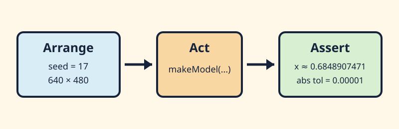

# Interlude — reading and writing the first C++ test

## See what you're making

A test is a small causal story, not a wall of assertions.



*A useful test separates fixed inputs, one action, and one answer you can check.*

The diagram is static, contains no audio, and needs no motion alternative. Its labels
and left-to-right arrows carry the sequence without relying on color.

## Take a guess

Read the final line of `foundation/unit/src/main.cpp`:

```cpp
return ofRunMainLoop();
```

Predict what a shell sees when every assertion passes and when one assertion fails. Then
predict why replacing that line with `ofRunMainLoop(); return 0;` would make a red suite look green to
automation.

## Let's unpack it

### Before the testing vocabulary

A test is just a small program that asks your code a question and complains when the
answer is wrong. For example: “When the seed is 17 and the window is this size, does the
model put the mark at the position you already worked out?”

Most tests in this course follow three ordinary steps:

1. make the input values;
2. run one function; and
3. compare the answer with what you expected.

Test writers call those steps **arrange, act, assert**. The name is less important than
the habit: keep each question small enough that a failure tells you what to look at.

The course also uses the word **fixture** for a saved test example: fixed input values
and, when useful, the answer you expect. It is just a reusable example, not a new kind
of mathematics.

### How a failed test reaches the terminal

You do not need to memorize the framework's internal call order. The practical chain is
short:

1. the test runs and counts failures;
2. it asks the app to exit with that failure count;
3. the main loop returns the count; and
4. `main()` returns it to the shell.

Zero means all tests passed. A number above zero tells the shell that something failed. A test program can compile successfully and still fail when it runs.

This course uses openFrameworks' [`ofxUnitTests`](https://github.com/openframeworks/openFrameworks/blob/0.12.1/addons/ofxUnitTests/src/ofxUnitTests.h) with an
[`ofAppNoWindow`](https://github.com/openframeworks/openFrameworks/blob/0.12.1/libs/openFrameworks/app/ofAppNoWindow.h) target. If you are curious about the framework plumbing, the pinned
[`ofAppRunner.cpp`](https://github.com/openframeworks/openFrameworks/blob/0.12.1/libs/openFrameworks/app/ofAppRunner.cpp) and
[`ofMainLoop.cpp`](https://github.com/openframeworks/openFrameworks/blob/0.12.1/libs/openFrameworks/app/ofMainLoop.cpp) show how that exit number travels back to `main()`.

### Which files go into each test program

The compiler handles each `.cpp` file, then the linker joins the compiled pieces
into one program. A header such as `expect_near.h` is included by a `.cpp` file;
it does not become a separate compiled piece.

| Test program | Source files from this repository | Where the program starts |
|---|---|---|
| Small starter test | `shared/core/course_probe.cpp`; `exercises/00-first-cpp-test/starter/learner_known_case.cpp`; `exercises/00-first-cpp-test/tests/learner_known_case_test.cpp` | the test runner's `main()` |
| Small solution test | `shared/core/course_probe.cpp`; `exercises/00-first-cpp-test/solution/learner_known_case.cpp`; `exercises/00-first-cpp-test/tests/learner_known_case_test.cpp` | the same test runner's `main()` |
| openFrameworks no-window test | `foundation/unit/src/main.cpp`; the intentionally empty `foundation/unit/src/ofApp.cpp` and `ofApp.h`; `shared/core/course_probe.cpp`; plus openFrameworks and `ofxUnitTests` files chosen by Project Generator | `foundation/unit/src/main.cpp` |

The windowed sketch's `foundation/windowed/src/main.cpp` and `ofApp.cpp` stay out of these test programs.
The first would add a second `main()` and the second contains drawing callbacks
the number-based test does not need. Both test programs reach the shared calculation
through `course_probe.cpp`.

### Arrange, act, assert

Use comments only when they clarify the roles; the values matter more than the labels:

```cpp
// Arrange: fixed input and an independently reviewed expected value.
const std::uint32_t seed = 17U;
const course::Viewport viewport{640.0f, 480.0f};
const float expectedX = 0.6848907471f;

// Act: one behavior.
const course::Model actual = course::makeModel(seed, viewport);

// Assert: check one answer and show a useful failure message.
const auto near = course::test::expectNear(actual.position.x, expectedX,
                                           1e-5, 1e-6);
ofxTest(near.passed, "known seed produces reviewed x", near.message);
```

A fixture is a reusable saved example. The `DeterministicFixture` class stores the seed,
window size, input, and time step and can make a fresh model from them.

Work out the expected answer separately. If the test asks the same function for both the
actual and expected answer, the function can agree with its own mistake. In this lesson,
the lesson simply calls it the **expected answer**: a number you calculated or reviewed another
way.

### Compare decimal answers with a little room

Computers cannot store every decimal exactly. A calculation that should look like `0.3`
may end up a tiny amount above or below it. The [C++ floating-point reference](https://en.cppreference.com/w/cpp/types/fenv.html) has the formal details; you
do not need them for this exercise.

Suppose the test gets `0.684891` and your separately worked answer is `0.684890`. The
difference is `0.000001`. If the allowed error is `0.00001`, the test passes because the
difference is smaller than the allowance.

The helper combines two allowances:

- `absTol` is a small fixed allowance, useful near zero; and
- `relTol` grows with larger numbers.

It uses whichever allowance is larger. Choose these values from how precise the behavior
needs to be, not merely to silence a failure. Whole-number counts and deliberately exact
state can still use exact equality.

### What a no-window test cannot tell you

A no-window test can check saved numbers, reset behavior, boundaries, and useful error
messages. It never opens the app or sees `draw()`.

Pictures vary slightly across graphics cards, drivers, fonts, and displays. More
importantly, a matching screenshot cannot tell you whether an image is meaningful,
readable, original, or accessible. Use fast number-based tests for calculations, then
open the app and judge the visual result yourself.

## Make it run

### Example 1: run the small test without openFrameworks

```sh
for variant in starter solution; do
  CXX=g++ tests/run-first-cpp-test.sh "$variant"
  CXX=clang++ tests/run-first-cpp-test.sh "$variant"
done
```

In Windows Developer PowerShell:

```powershell
foreach ($variant in @("starter", "solution")) {
    .\tests\run-first-cpp-test.ps1 -Variant $variant
}
```

Each variant runs the same small calculation with the same comparison helper. The real
model must pass, while an intentionally changed one-pixel answer must fail. That proves
the test can catch the mistake instead of merely printing a green message.

### Example 2: run the real no-window executable

After setting `OF_ROOT` to openFrameworks 0.12.1:

```sh
scripts/foundation.sh generate --project unit
scripts/foundation.sh build --project unit --configuration Release
scripts/foundation.sh test --project unit --configuration Release
```

In Windows Developer PowerShell:

```powershell
.\scripts\foundation.ps1 generate -Project unit
.\scripts\foundation.ps1 build -Project unit -Configuration Release
.\scripts\foundation.ps1 test -Project unit -Configuration Release
```

A successful run returns zero and prints one `12/12 tests passed` summary. The existing
foundation test app is reused here so you do not have to maintain a second identical
native project. The [three-platform build notes](../../../docs/foundation-harness-evidence.md) describe
the Linux, macOS, and Windows setups used for the course. Your local run checks only your
current machine and code.

## Break it on purpose

Make this change only long enough to see the failure, then repair it. In
`foundation/unit/src/main.cpp`, find the seeded viewport check and replace:

```cpp
first.position.x >= 0.0f
```

with the deliberately wrong assertion:

```cpp
first.position.x < 0.0f
```

Build and run the Release unit executable with the commands above. Read the named
failure and nonzero wrapper result. Repair it to `>= 0.0f`, rerun, and require
`12/12 tests passed`. If this is your only intended edit, this command restores the
file:

```sh
git restore -- foundation/unit/src/main.cpp
```

It discards every uncommitted change in that file, so inspect `git diff` first. Finish
with the repaired check in place.

## Your turn

Open the [exercise brief](../../../exercises/00-first-cpp-test/README.md) and edit only
`starter/learner_known_case.cpp`.

1. Choose a fixed seed and an ordinary positive window size. Leave the four expected
   answers alone for the moment.
2. Immediately after the one call that creates `actual`, temporarily print its position
   and velocity. The exercise brief shows the exact line to add.
3. Run the starter test. Copy the four printed numbers into clearly labeled notes.
4. Check that the position is inside your chosen window and the speed looks reasonable.
   Run again with the same seed and confirm the numbers repeat.
5. Put those reviewed numbers into the four expected-value slots, then remove the
   temporary print and include. Run the test again.

Why not ask the model to calculate its own expected answer inside the test? Because the
same mistake could appear in both places and quietly agree with itself. Saving one
reviewed answer gives the test something independent to compare against.

The runner tries your test with the real model and with a deliberately wrong version.
The real one should pass; the wrong one should produce a useful numerical message. The
explained solution uses a different seed, so it does not reveal your four answers.

## Check your work

Run the starter with both compiler commands, then run the foundation unit commands. Look
for three things:

- the assertion you repaired now accepts a position at or to the right of zero;
- the real model matches the four reviewed numbers within the allowed rounding
  difference; and
- the deliberately wrong model fails with a message that shows the actual and expected
  values.

These tests check calculations, not pictures. A failing run returns a nonzero number to
the shell; a passing run returns zero.

## Optional notes for future you

Jot down the input you chose, the four expected numbers, and one failure message that
helped. Also note that a no-window test can check arithmetic but cannot tell you whether
a picture looks right.

## One idea for later

Think of one edge case `makeModel` might need to handle—for example a very small window
or a zero time step. You do not need to write that test now. If you do, keep it focused
on one rule and use an approximate comparison for calculated decimal values.

## Quick visual check

There is no picture to review in this interlude. Make sure the failure message names the
value that differed and the final run is green. If you save a terminal screenshot, its
alt text should mention the failed check and useful numbers rather than saying only
“test failure.”

## If you get stuck

A failed assertion is not a verdict on your programming career; it is a clue with
unusually dramatic punctuation. Read the actual and expected values, fix one thing, and
run the smallest test again. If the harness feels mysterious, return to arrange → act →
assert and write down the one value you expect before running it.
