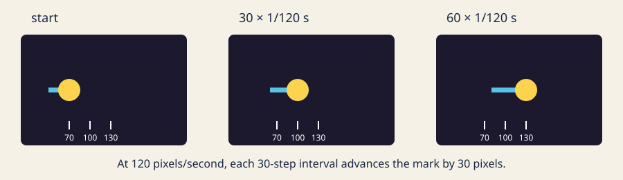

# A mark that moves

This section follows the same three-step path: learn how motion is represented,
practice the calculation and callbacks, then solve one tested traveler problem.

1. [Lesson: understand state and time](#lesson)
2. [Practice: calculate, trace, and repair](#practice)
3. [Exercise: complete the tested traveler](#exercise)

## Lesson

### Motion is remembered position



*At 120 pixels per second, each 30-step interval advances the mark by 30 pixels; position and ticks communicate the change without relying on color.*

Animation is a series of still pictures. A program remembers a position, changes
it a little, and draws the next frame. The remembered values are **state**; a
change to them is an **update**.

Suppose `x` begins at 100 and the mark moves at 120 pixels per second. One
update represents 1/60 second:

```text
120 pixels/second × 1/60 second = 2 pixels
100 pixels + 2 pixels = 102 pixels
```

The reusable rule is:

```text
next position = current position + velocity × elapsed seconds
```

Code often calls elapsed time `dt`. Seconds cancel seconds, leaving pixels.

### Variables hold the state

A variable has a type, a name, and a value:

```cpp
float x = 100.0f;       // fractional pixels
float speed = 120.0f;   // pixels per second
int pointer_x = 320;    // a whole pixel from an input callback
bool paused = false;    // yes or no
```

`float` suits positions, rates, and elapsed seconds. `int` suits whole pointer
coordinates. `bool` records a two-way mode. The
[C++ fundamental-types reference](https://en.cppreference.com/w/cpp/language/types.html)
has the formal details; these are the only types you need here.

### Callbacks divide the work

The [openFrameworks events documentation](https://openframeworks.cc/documentation/events/ofEvents.html)
defines when callbacks run:

- `setup()` creates the initial state once.
- `update()` changes state; it does not draw.
- `draw()` reads state and draws; it does not advance time.
- pointer and keyboard callbacks update input state.

The small layer that receives framework events and passes ordinary values to the
model is an **adapter**. Keeping calculations outside the adapter lets tests run
without a graphics window.

### Why the model uses fixed steps

The adapter gets the previous frame duration in seconds from
[`ofGetLastFrameTime()`](https://openframeworks.cc/documentation/utils/ofUtils.html#show_ofGetLastFrameTime).
It never multiplies that value by 1000.

A direct variable-step update is simple:

```cpp
position += velocity * frame_seconds;
```

But steering and boundary decisions can differ when the same time is divided
into differently sized frames. The exercise uses the accumulator technique from
[Fix Your Timestep!](https://gafferongames.com/post/fix_your_timestep/):

```text
frame = clamp(valid_seconds, 0, 0.1)
accumulator += frame
while accumulator >= 1/120:
    simulate exactly 1/120 second
    accumulator -= 1/120
```

A remainder waits for the next frame. Zero, negative, `NaN`, and infinite frame
durations do not move the mark. Returning after a long pause advances at most
0.1 second, preventing a huge catch-up jump.

### Input, wrap, and reduced motion

At each step, the pointer direction is `target - position`. Before a pointer
event, arrow keys provide a fallback direction. The model normalizes that
direction and applies the chosen speed.

The mark's center may leave by one radius so it disappears fully, then wraps to
the opposite outer edge while preserving overshoot. Space toggles pause, `R`
resets the repeatable motion state, and `M` uses one-quarter speed. Reset keeps
the reduced-motion preference.

## Practice

Practice is guided and has no unit-test gate. Work through one calculation,
trace the callbacks, run the app, and repair one unit mistake.

### 1. Calculate one update by hand

Start with:

```cpp
float x = 100.0f;
const float speed = 120.0f;
const float dt = 1.0f / 60.0f;
x = x + speed * dt;
```

Before checking the answer, calculate `speed * dt`. The new `x` is `102.0f`.
Now imagine `dt` were `16.67` milliseconds mistakenly treated as seconds: the
same expression would request roughly 2000 pixels of movement. Types cannot
catch a wrong unit when both values are `float`.

### 2. Trace a fixed-step frame

Read `advanceFrame(...)` in
[`traveler_model.cpp`](../../../exercises/01-a-mark-that-moves/shared/traveler_model.cpp).
Follow a frame duration of `1/30` second through the accumulator. It becomes
four updates of `1/120` second. At 120 pixels per second, each update moves one
pixel, for four pixels total.

Next trace a frame duration of `1/240` second. It is half a fixed step, so the
first frame moves zero pixels and keeps the remainder. A second `1/240` frame
completes one step and moves one pixel.

### 3. Build and explore the working example

Use the supplied solution as a known-good practice app. You are only exploring
its controls here; the Exercise will start from the incomplete starter.

```sh
scripts/section-01.sh generate --project solution
scripts/section-01.sh build --project solution --configuration Release
```

On Windows Developer PowerShell:

```powershell
.\scripts\section-01.ps1 generate -Project solution
.\scripts\section-01.ps1 build -Project solution -Configuration Release
```

Open the app. Try pointer steering, every arrow key, Space, `R`, and `M`. Resize
the window and watch the wrap at all four edges.

### 4. Repair a seconds-versus-milliseconds bug

In `exercises/01-a-mark-that-moves/solution/src/ofApp.cpp`, temporarily change:

```cpp
ofGetLastFrameTime()
```

to:

```cpp
ofGetLastFrameTime() * 1000.0f
```

The code still compiles. Predict the symptom, run it briefly, and notice how the
0.1-second clamp limits—but does not hide—the mistake. Remove `* 1000.0f` and
rebuild. Do not regenerate because no source file was added or removed.

If this was your only intended edit, restore it with:

```sh
git restore -- exercises/01-a-mark-that-moves/solution/src/ofApp.cpp
```

That command discards every uncommitted change in the named file.

## Exercise

### Problem: complete a wraparound traveler

Implement the missing `stepDistance(rate, elapsed_seconds)` calculation, then
choose a normalized start, speed, radius, and three colors. The mark must move
toward pointer input, support arrow-key fallback, wrap with overshoot, pause
without a resume jump, reset repeatably, and retain reduced-motion mode through
reset.

The starter is intentionally incomplete: the `TODO` calculation and design
values make its tests fail. Open the
[Exercise 01 brief, starter, tests, and solution](../../../exercises/01-a-mark-that-moves/README.md),
then edit `starter/src/design/traveler_design.cpp`. Keep the public model and
function names unchanged. After the model passes, change the silhouette or trail
in `starter/src/ofApp.cpp`; tests inspect state, not pixels.

### Run the unit tests

Linux or macOS:

```sh
tests/run-section-01-tests.sh
```

Windows Developer PowerShell:

```powershell
.\tests\run-section-01-tests.ps1
```

The tests check attributes that demonstrate the model rules:

- `stepDistance` multiplies signed rate by elapsed seconds;
- one fixed step moves by the expected distance;
- equal elapsed-time partitions produce the same fixed-step result;
- invalid durations, pause, and the 0.1-second clamp behave safely;
- all four wrap boundaries preserve a finite state;
- reset reproduces the chosen start and preserves reduced motion; and
- chosen speed, radius, normalized start, and RGB values are valid.

Once the tests pass, generate, build, and open the starter again. A green model
suite cannot decide whether motion, contrast, or controls are visually clear.

### Quick visual check

- Pointer and arrow input each have an immediately legible effect.
- Space pauses without a resume jump; `R` repeats the start.
- `M` is visibly slower and remains enabled after reset.
- Wrap is clean on every edge at narrow and wide window sizes.
- A line, silhouette, or placement communicates direction without color alone.
- The result differs from the starter and solution in more than its palette.
- No flashing or rapid full-field changes occur.

### If you get stuck

Start with `stepDistance`: at 120 pixels per second and 1/60 second, the answer
must be 2 pixels. Then run the tests again and address the first failure only.
If the app jumps or vanishes after tests pass, inspect position, speed, and `dt`
one at a time. Check the units before changing the accumulator.
