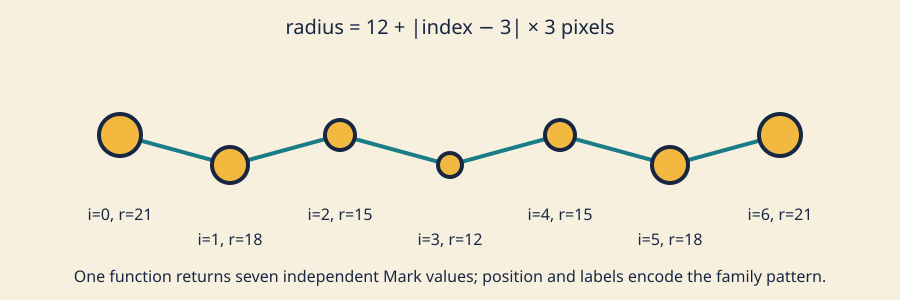

# The Python-to-C++ survival kit

## See what we're making

One parameter record can generate many related values.



*Index labels, position, and size show one parameter rule producing a family without relying on color.*

The preview is static and has no audio. The exercise also stays still, so it
requires no motion fallback. Shape, position, index, and size—not color
alone—communicate the family relationship.

## Take a guess

Read this signature left to right:

```cpp
std::vector<Mark> makeMarkFamily(const Design& design, Viewport viewport);
```

Predict which argument the function may change, what kind of value comes back,
and whether that returned collection remains usable after the function ends.
Then predict the size when `design.count` is `7` and the implementation performs
one `push_back(...)` per index from `0` through `6`.

## Let's unpack it

### The small, useful Python comparison

Python and C++ can express the same decomposition:

```python
def radius_for(base, step, centered_index):
    return base + abs(centered_index) * step
```

```cpp
float radiusFor(float base, float step, float centered_index) {
    return base + std::fabs(centered_index) * step;
}
```

Both have a function name, parameters, a body, and a returned result. The
important difference here is that the C++ declaration makes types and return
shape explicit before the body runs. Python names bind to objects and Python
calls check operations at runtime; this course's C++ compiler checks the shown
parameter and return contracts while building. This is a reading bridge, not a
Python toolchain or a claim that the languages behave identically.

The [C++ functions reference](https://en.cppreference.com/w/cpp/language/functions.html)
is dense, so begin with punctuation:

```text
return type        name             parameter 1          parameter 2
std::vector<Mark>  makeMarkFamily(  const Design& design, Viewport viewport )
```

At a call site, hover or find the declaration in the header. Ask in order:

1. What is returned?
2. What parameters are required, in what order?
3. Does `const` forbid mutation through this name?
4. Does `&` mean this parameter refers to the caller's existing object?
5. Is there a documented invalid-input result?

Here invalid design or viewport input returns an empty vector, an inspectable
value rather than hidden drawing. A viewport narrower than 2 pixels in either
dimension also returns empty: it cannot contain the model's minimum 1-pixel
radius.

### Values, const, and const references

A value parameter such as `Viewport viewport` is a local copy. Changing that
local copy would not change the caller's viewport. `const Design& design` is a
[reference](https://en.cppreference.com/w/cpp/language/reference.html) to the
caller's design; the function avoids a copy, and `const` promises not to modify
that design through this reference.

Use `const` for a local name when the value should not be reassigned:

```cpp
const float center_x = design.normalized_center.x * viewport.width;
```

`const` is not ceremonial. It narrows what later code can do and lets the
compiler reject accidental reassignment. It does not make every value in the
program immutable.

The return type has no `&`:

```cpp
std::vector<Mark> makeMarkFamily(...)
```

The function returns a vector value. The caller owns that result. Modern C++
can construct or move the result efficiently; do not return a reference to a
local variable that is about to disappear.

### One substantial mechanism: std::vector

A Python list can contain references to objects of different types. A
[`std::vector<Mark>`](https://en.cppreference.com/w/cpp/container/vector.html)
is a growable, contiguous collection whose elements are all `Mark` values.
This section needs only:

```cpp
std::vector<Mark> marks;
marks.reserve(count);       // capacity only; size is still zero
marks.push_back(next_mark); // appends one value; size grows by one
return marks;
```

`reserve(7)` prepares storage but adds no elements. `resize(7)` changes size by
creating seven elements. That difference drives the repair task.

An indexed loop provides an index for formulas:

```cpp
for (int index = 0; index < design.count; ++index) {
    // calculate one Mark using index, then push_back it
}
```

A [range-based for loop](https://en.cppreference.com/w/cpp/language/range-for.html)
reads each existing value clearly:

```cpp
for (const Mark& mark : marks) {
    drawMark(mark);
}
```

`const Mark&` avoids copying each element and forbids changing it through
`mark`. Use an indexed loop when adjacent elements or the numeric index matter;
use a range loop when each element is enough. Neither style is universally
better.

### Scope, lifetime, and ownership

A local variable's scope ends at its closing brace. Its value usually ends
there too. A vector owns its elements, so a returned vector value carries its
marks to the caller. A reference is an alias, not ownership; retaining a
reference after its object dies creates a dangling reference. The
[object-lifetime reference](https://en.cppreference.com/w/cpp/language/lifetime.html)
contains the full rules. For this exercise, keep references short-lived and
return owned values.

The [`new` expression](https://en.cppreference.com/w/cpp/language/new.html)
can create dynamically allocated objects, but raw `new` requires a correct
ownership and matching-release policy. Leaks, double deletion, and dangling
pointers distract from visual structure. We deliberately defer raw `new` and
`delete`; `std::vector` owns this collection, while the existing openFrameworks
window setup uses library-standard smart ownership. Deferral is not a claim
that allocation never occurs.

### One family rule: visual, numeric, symbolic

The preview uses seven marks, center index `3`, base radius `12`, and radius
step `3` pixels:

```text
indices:     0   1   2   3   4   5   6
distance:    3   2   1   0   1   2   3
radius px:  21  18  15  12  15  18  21
```

Numerically at index `1`:

```text
12 + |1 - 3| × 3 = 18 pixels
```

Symbolically, for index `i`, center index `c`, base `b`, and step `s`:

```text
r(i) = clamp(b + |i - c|s, minimum, viewport maximum)
```

Changing count, spacing, base radius, or step creates a related family rather
than seven unrelated drawing calls.

## Make it run

Keep the model, renderer, and generated native metadata separate.

### Example 1: a tiny returned collection

```cpp
std::vector<float> twoRadii(float first, float second) {
    return {first, second};
}

const std::vector<float> radii = twoRadii(8.0f, 13.0f);
```

`radii` owns two values after `twoRadii` returns.

### Example 2: inspect the deterministic family

Read [`mark_family.h`](../../../exercises/02-python-to-cpp-survival-kit/shared/mark_family.h)
and [`mark_family.cpp`](../../../exercises/02-python-to-cpp-survival-kit/shared/mark_family.cpp).
The public fixture calls the model without openFrameworks:

```sh
tests/run-section-02-tests.sh
```

It builds each fixture twice, parses independent expected first/middle/last
center, radius, and index values, then checks those numerical known oracles,
size, finite values, viewport bounds, and equal repeated values.

### Example 3: generate and compile the adapter

```sh
scripts/section-02.sh generate --project starter
scripts/section-02.sh build --project starter --configuration Release
```

In Windows Developer PowerShell:

```powershell
.\scripts\section-02.ps1 generate -Project starter
.\scripts\section-02.ps1 build -Project starter -Configuration Release
```

The generalized wrappers preserve Project Generator ownership and validate
exact source membership. A local Linux build is not macOS or Windows evidence;
require the matching commit statuses. Compilation is not graphical runtime or
manual accessibility evidence.

## Break it on purpose

In the exact tracked file
`exercises/02-python-to-cpp-survival-kit/shared/mark_family.cpp`, temporarily
change:

```cpp
marks.reserve(static_cast<std::size_t>(design.count));
```

to:

```cpp
marks.resize(static_cast<std::size_t>(design.count));
```

Run `tests/run-section-02-tests.sh`. Predict why a requested count of seven now
returns fourteen elements: `resize` creates seven default-initialized elements,
then the loop appends seven calculated elements. Read the size failure before
repairing `resize` back to `reserve`. If that was your only intended change,
restore the exact file with:

```sh
git restore -- exercises/02-python-to-cpp-survival-kit/shared/mark_family.cpp
```

That command discards every uncommitted change in the named file. Record the
failing contract, capacity-versus-size distinction, and repaired result.

## Your turn

Open the [family brief](../../../exercises/02-python-to-cpp-survival-kit/README.md).
First edit only
`exercises/02-python-to-cpp-survival-kit/starter/src/design/family_design.cpp`.
Choose count, center, spacing, base radius, radius step, and colors within its
documented ranges. Then edit
`exercises/02-python-to-cpp-survival-kit/starter/src/ofApp.cpp` to create your
own repeated silhouette, internal cue, connection, or parameter mapping.

The starter uses circles with vertical ticks. The explained solution uses
linked hourglasses, alternates two colors, and increases size away from center.
Create a third visual treatment. Keep shape or placement meaningful without
color alone. There is no target screenshot.

## Check your work

Run both compiler variants when available:

```sh
CXX=g++ tests/run-section-02-tests.sh
CXX=clang++ tests/run-section-02-tests.sh
```

On Windows Developer PowerShell:

```powershell
.\tests\run-section-02-tests.ps1
```

Known fixture cases cover wide, narrow, and large families. The constrained
viewport is a boundary case; `1xN`, `Nx1`, and `1x1` viewports return empty.
Properties check exact collection size, finite and in-bounds values,
deterministic repeated construction, numerical first/middle/last oracles, and
normalized-center/spacing/base-radius/radius-step changes one parameter at a
time. The learner contract compiles the starter
design, not the solution. It validates ranges and state, never source style,
pixels, or resemblance. Contrast and originality remain manual.

Generate and compile both starter and solution in Debug and Release before a
release claim. Launch each manually to inspect visuals; CI build names claim
native compilation only.

## Tell the story

In 110–150 words, annotate the `makeMarkFamily` signature: return, each
parameter, `const`, and `&`. Explain why the returned vector survives the
function, why `reserve` is not `resize`, and why raw `new`/`delete` is deferred.
Name one learner-owned visual choice and include alt text for one capture.

## Make it yours

Keep the public function and tests, but change one mapping: arc placement,
alternating vertical offset, size by distance from pointer captured on rebuild,
or two parameter groups. Predict which collection properties remain true and
which representative values change. Remix geometry or mapping, not only color.

## Quick visual check

- Every repeated mark remains legible at narrow and wide window sizes.
- Shape, stroke, placement, or labels communicate the family without color.
- Mark/background contrast is suitable; no flashing or rapid full-field change occurs.
- The result differs from preview, starter circles, and solution hourglasses in geometry or mapping—not only palette.
- Capture alt text states count, silhouette, size/placement pattern, and relationship.
- The code uses short-lived const references and owned returned values; it adds no raw `new`/`delete`.
- Reused code and assets remain credited and license-compatible.

## If you get stuck

C++ punctuation has a talent for hiding in plain sight. Read the first compiler
error, check braces and semicolons near that line, and compare the function
signature with the call site. If a vector behaves strangely, ask whether you
wanted to reserve space or resize the collection. Make the smallest repair you
can explain, then run the test again.
