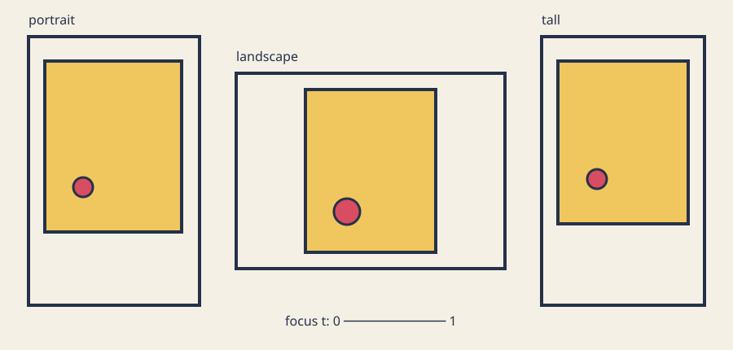

# Map, clamp, and lerp

## Look

A responsive composition preserves relationships, not fixed pixel coordinates.



*One layout rule fits a fixed-aspect poster into portrait, landscape, and tall viewports without stretching.*

The preview is static, with no audio or motion alternative required. Viewport
outlines, panel boundaries, labels, and position communicate the relationship
without color alone.

## Predict

A viewport's short side is `600`. We want `320` to mean progress `0` and `1200`
to mean progress `1`. Before calculating, predict whether `600` normalizes
below, at, or above `0.5`. Then predict whether a 4:5 poster fitted into an
`800 x 600` window will be limited by width or height.

## Learn

### Normalize: turn a source range into progress

For a value `x` between `input_min` and `input_max`, normalized progress is:

```text
t = (x - input_min) / (input_max - input_min)
```

With `x=600`, `input_min=320`, and `input_max=1200`:

```text
t = (600 - 320) / (1200 - 320)
  = 280 / 880
  = 0.3181818...
```

Normalization is also called inverse interpolation: ordinary interpolation
turns `t` into a ranged value, while normalization recovers `t` from that
range. Our helper requires an ascending source range: `input_min < input_max`. It
returns `0` for an equal or descending source range, or when the value or
source endpoints are non-finite, then clamps valid results to `[0, 1]`. That
invalid-input rule is explicit rather than an accidental division by zero.

### Lerp: turn progress back into a range

Linear interpolation, or lerp, uses:

```text
lerp(a, b, t) = a + (b - a) * t
```

At endpoints and midpoint:

```text
lerp(16, 64, 0)   = 16
lerp(16, 64, 0.5) = 40
lerp(16, 64, 1)   = 64
```

The [openFrameworks `ofLerp` reference](https://openframeworks.cc/documentation/math/ofMath/#!show_ofLerp)
uses the same start, stop, and amount idea. The course model keeps its own small
renderer-independent helper so a normal C++ compiler can test it.

### Map is normalize, then lerp

Mapping from one range into another is composition, not a separate mystery:

```cpp
float mapClamped(float x, float in_min, float in_max,
                 float out_min, float out_max) {
    const float t = normalizeClamped(x, in_min, in_max);
    return lerpClamped(out_min, out_max, t);
}
```

For `x=15`, input `[10, 20]`, and output `[-1, 1]`, normalization gives `0.5`
and lerp gives `0`. The
[openFrameworks `ofMap` reference](https://openframeworks.cc/documentation/math/ofMath/#!show_ofMap)
also documents source and destination ranges and an optional clamp behavior.
Write the ranges beside a mapping before writing code. Only destination
endpoints may be swapped to reverse direction in this course helper. Source
endpoints must ascend; equal or descending source ranges are invalid and
produce deterministic progress `0`.

### Clamp states the safe domain

A focal control belongs to `[0, 1]`. Values below zero use zero, and values above
one use one:

```cpp
return std::clamp(value, 0.0f, 1.0f);
```

[`std::clamp` is part of C++17](https://en.cppreference.com/w/cpp/algorithm/clamp.html).
Clamping is not a repair for every bug: it is appropriate only when an endpoint
is the documented safe result. The layout rejects viewports smaller than
`64 x 64` instead of pretending a useful poster fits there.

### Fit aspect ratio; do not stretch

The target poster aspect is `width / height = 4 / 5 = 0.8`. Start with available
width and derive height:

```text
panel_height = available_width / 0.8
```

If that height exceeds available height, height is the limiting dimension:

```text
panel_height = available_height
panel_width  = panel_height * 0.8
```

Finally center the panel. At `320 x 400`, 16-pixel padding leaves `288 x 368`.
Width-limited fitting gives a `288 x 360` panel at `(16, 20)`. At `800 x 600`,
height limits the panel to about `429.964 x 537.455`. The ratio remains `0.8`;
unused space changes sides instead of distorting the poster.

### One easing curve

Linear progress changes at a constant rate. Smoothstep shapes the same bounded
progress:

```text
smoothstep(t) = t²(3 - 2t), for clamped t in [0, 1]
```

It keeps endpoints `0` and `1`, keeps midpoint `0.5`, and remains monotonic, but
starts and ends more gently. The
[easing reference gallery](https://easings.net/)
shows why a shaped curve feels different from linear progress. We use only
smoothstep for headline size and focal radius; padding stays linear so the two
behaviors can be compared. Easing does not add time or animation here.

### Helpers before drawing

`shared/poster_layout.cpp` knows numbers and records, not `ofDraw...` calls.
`makeLayout()` accepts a `Design` and `Viewport`, then returns an inspectable
`Layout`. `ofApp::windowResized()` rebuilds that layout; `draw()` consumes it.
This boundary makes resizing deterministic and testable without a display.

The learner-owned `Design` contains horizontal focus, vertical bias, and palette.
The shared helper owns course mechanics: safe ranges, panel fitting, scale, and
bounds. Change the design and rendering treatment without duplicating mapping
math inside `draw()`.

### Float checks need a stated tolerance

Decimal results such as `280 / 880` are not generally represented exactly by a
binary `float`. The
[C++ fundamental-types reference](https://en.cppreference.com/w/cpp/language/types.html)
documents finite floating-point range and precision; programs do not calculate
with exact real numbers. Tests compare difference against:

```text
allowed = max(absolute_tolerance,
              relative_tolerance * abs(expected))
```

This section uses absolute tolerance `0.002` for pixel-scale fixture values and
relative tolerance `0.000001` as values grow. A failure prints component,
actual, expected, difference, and both tolerances. Do not pick a huge tolerance
just to turn a red test green; derive it from scale and expected computation.
Pixels are not compared.

## Try the calculations

1. Normalize `760` from `[320, 1200]`. The answer is `0.5`.
2. Map that progress into padding `[16, 64]`. The answer is `40`.
3. Evaluate smoothstep at `0.5`. The answer remains `0.5`.
4. Fit a 4:5 panel inside `500 x 500` after 40-pixel padding. Available size is
   `420 x 420`; height is `420`, width is `336`, and the panel begins at `x=82`.
5. Set focus to `0`, `0.5`, and `1`. The focal circle reaches the left safe
   endpoint, center, and right safe endpoint without crossing the panel.

Sketch the panel rectangles before running code. Symbolic equations explain the
rule, the numerical cases verify arithmetic, and the preview shows the visual
consequence; none replaces the others.

## Break and repair

In the exact tracked file
`exercises/03-map-clamp-and-lerp/shared/poster_layout.cpp`, temporarily change:

```cpp
panel_width = panel_height * poster_aspect;
```

to:

```cpp
panel_width = panel_height / poster_aspect;
```

Run `tests/run-section-03-tests.sh`. Predict which parsed panel-width oracle,
4:5 aspect property, and in-bounds cases fail. Read the numerical diagnostic,
then restore multiplication. If this was your only intended edit, use:

```sh
git restore -- exercises/03-map-clamp-and-lerp/shared/poster_layout.cpp
```

That command discards every uncommitted change in the named file. Record the
failure, the width/height equation, and the repaired result.

## Exercise

Open the [responsive poster brief](../../../exercises/03-map-clamp-and-lerp/README.md).
Edit exactly
`exercises/03-map-clamp-and-lerp/starter/src/design/poster_design.cpp` first.
Choose focus, vertical bias, and palette inside documented ranges. Then edit
`exercises/03-map-clamp-and-lerp/starter/src/ofApp.cpp` to create your own
hierarchy and responsive geometry.

The starter is a filled panel, single focal dot, and rule. The explained
solution uses an outline, nested orbit circles, triangle, and negative space.
Its outer orbit responds to the distance available around the focus, so all
three rings remain contained even at the valid `64 x 64` boundary. Make a third
composition that differs in geometry or mapping, not only color. There is no
target screenshot.

## Test

On Linux or macOS, use both compilers when available:

```sh
CXX=g++ tests/run-section-03-tests.sh
CXX=clang++ tests/run-section-03-tests.sh
```

On Windows Developer PowerShell:

```powershell
.\tests\run-section-03-tests.ps1
```

Fixtures parse every expected panel, headline, radius, and focus value. Public
properties cover helper endpoints, out-of-range clamping, invalid equal and
descending source ranges, non-finite policy, midpoint, monotonic smoothstep,
focus endpoints, resize, 4:5 aspect, finite in-bounds geometry, orbit
containment at the valid `64 x 64` boundary, invalid smaller viewports,
deterministic replay, and learner design ranges. Tests compile the starter design, not the solution. They do not inspect
source style, pixels, contrast, or resemblance.

Generate and compile both starter and solution in Debug and Release before a
release claim. Launch each manually at portrait, square, and landscape sizes;
native CI names prove compilation only, not graphical runtime.

## Reflect

In 120–160 words, explain normalize as inverse interpolation, lerp, map as their
composition, the reason for clamping, and the two-branch aspect fit. Compare
linear padding with eased radius. Name the tolerance and one learner-owned
visual decision. Include alt text for one capture.

## Remix

Keep the model contract but change one relationship: reverse focus direction,
map aspect into a grid count, use smoothstep for margin instead of radius, or
fit a different target ratio. Predict endpoint, midpoint, monotonicity, and
resize consequences before changing code.

## Manual review

- Hierarchy remains legible at portrait, square, landscape, and minimum useful sizes.
- Shape, spacing, outline, or labels communicate structure without color alone.
- Ink/background and accent/background contrast are suitable; nothing flashes.
- Geometry or mapping differs from both starter and solution, not only palette.
- Capture alt text names panel aspect, focus, hierarchy, and viewport relationship.
- Resizing does not crop focal geometry or stretch the 4:5 panel.
- Reused code and assets remain credited and license-compatible.

## Pilot note

Pilot evidence not yet collected. After a learner completes this section,
record exact platform/tool versions; reading, calculation, repair, exercise,
and reflection time separately; setup friction; whether inverse interpolation,
range direction, aspect fitting, smoothstep, and tolerance were understood;
automated test outcome; manual resize/accessibility/originality review; and
points of confusion. Do not infer learner timing from CI or author tests.
