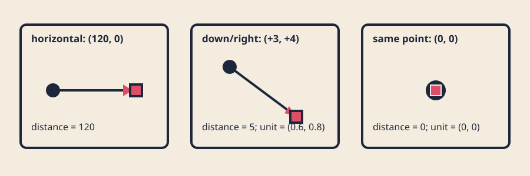

# Vectors, direction, and distance

## Look



*Subtraction gives direction components; length gives distance; guarded normalization gives a unit direction or zero.*

The static preview needs no motion or audio alternative. Circle/rectangle endpoint
shapes, arrow lines, labels, and equations communicate roles without color alone.

## Predict

An anchor is at `(20, 30)` and a target at `(23, 34)`. Before calculating,
predict the direction components, distance, and unit direction. Then predict
what should happen when anchor and target are the same point.

## Learn

### A vector is two components

A two-dimensional vector stores horizontal and vertical components:

```cpp
struct Vec2 { float x; float y; };
```

`(3, 4)` means three units in positive x and four in positive y. In the usual
openFrameworks window, x increases rightward and y increases downward. Thus
`(0, -12)` points up, not down. A vector can represent a point, displacement,
velocity, or other paired quantity; the surrounding name supplies meaning.

Visual, numerical, and symbolic views answer different questions:

```text
visual:    an arrow right 3 and down 4
numerical: (3, 4)
symbolic:  v = target - anchor
```

### Subtraction gives a direction displacement

To point **from anchor to target**, subtract in that order:

```text
direction = target - anchor
          = (target.x - anchor.x, target.y - anchor.y)
```

For anchor `(20, 30)` and target `(23, 34)`:

```text
direction = (23 - 20, 34 - 30) = (3, 4)
```

Swapping operands gives `(-3, -4)`, the opposite direction. Keep the phrase
“to minus from” beside the expression until the order feels natural.

### Length and distance

The Pythagorean theorem gives vector length:

```text
length(v) = sqrt(v.x² + v.y²)
length((3, 4)) = sqrt(9 + 16) = 5
```

Distance between points is the length of their difference:

```text
distance(anchor, target) = length(target - anchor)
```

Distance is never negative. The [GLM geometric-functions reference](https://glm.g-truc.net/0.9.9/api/a00212.html)
lists the same `length`, `distance`, `dot`, and `normalize` vocabulary commonly
seen in graphics code. Our small course `Vec2` remains standard-library-only so
its mechanics can be tested without a renderer. It uses
[`std::hypot`](https://en.cppreference.com/w/cpp/numeric/math/hypot.html) to
compute length without first storing `x*x + y*y` as a potentially overflowing
intermediate.

### Normalize safely

Normalization keeps direction while changing nonzero length to one:

```text
unit = direction / length(direction)
(3, 4) / 5 = (0.6, 0.8)
```

But dividing `(0, 0)` by length zero is invalid. The guard is part of the
contract, not optional cleanup:

```cpp
Vec2 normalizeOrZero(Vec2 value) {
    float magnitude = length(value);
    if (magnitude <= 0.0f) return {0.0f, 0.0f};
    return scale(value, 1.0f / magnitude);
}
```

Our non-finite policy is also explicit: non-finite vector inputs produce zero
length and a zero normalized vector; a non-finite requested target makes a
scene invalid. The model never lets NaN silently enter drawing coordinates.

### Scale direction into speed or reach

A unit direction separates **where** from **how far**:

```text
step = unit_direction * speed
next = current + step
```

For unit `(0.6, 0.8)` and speed `10`, step is `(6, 8)` and has length `10`.
`moveToward()` uses `min(distance, max_step)`, so a point five pixels away does
not overshoot when maximum step is twenty. In this section `reach` is a spatial
limit recomputed from input, not elapsed-time animation; later motion can
multiply speed by fixed `dt`.

The model exposes `dot(a, b) = a.x*b.x + a.y*b.y` because self-dot explains
`squared length`: `dot((3,4),(3,4)) = 25`. No angle or lighting behavior needs
the dot product here, so the exercise does not add those concepts prematurely.

### Input becomes data at the boundary

The openFrameworks adapter receives pointer coordinates through
[`mouseMoved`](https://openframeworks.cc/documentation/application/ofBaseApp/#!show_mouseMoved)
and arrow-key events through
[`keyPressed`](https://openframeworks.cc/documentation/application/ofBaseApp/#!show_keyPressed).
Both update one `requested_target_`, then call the same pure `makeScene()`.
Arrow keys move by 12 pixels per event, providing an input alternative and a
clear component example: left changes x by `-12`; up changes y by `-12`.

Input can lie outside the window. The model clamps target centers to a 12-pixel
safe inset. The starter's 8-pixel target half-extent plus half of its 4-pixel
stroke occupies 10 pixels, leaving 2 pixels of margin, so visible geometry—not
merely nominal centers—remains inside. After every valid rebuild, the adapter
synchronizes its requested target to that clamped center. An arrow key therefore
moves exactly 12 pixels inward even immediately after an out-of-window pointer
event. A
viewport smaller than `64 x 64`, an invalid learner design, or a non-finite
target returns an inspectable invalid scene.

### Renderer-independent constellation

`shared/constellation_model.cpp` computes anchor, clamped target, direction,
distance, guarded unit direction, traveler, and two perpendicular satellites.
It contains no `ofDraw...` call. `ofApp` only translates those values into
lines, circles, and triangles.

The learner-owned `Design` controls anchor fractions, maximum reach, and
palette. The shared model owns safety and vector mechanics. Tests compile the
starter design so changing a learner parameter can turn the public contract red.

### Approximate comparisons still matter

`sqrt` and normalization usually produce binary floating-point approximations.
Fixtures compare with absolute tolerance `0.002` and relative tolerance
`0.000001`, reporting actual, expected, difference, and both tolerances. The
independent `(3,4)` fixture expects exactly understandable values—distance `5`,
unit `(0.6,0.8)`—while a clamped boundary fixture records rounded decimal
oracles. There is no pixel comparison.

## Try the calculations

1. From `(20,30)` to `(23,34)`: direction `(3,4)`, distance `5`, unit `(0.6,0.8)`.
2. From `(10,8)` to `(4,8)`: direction `(-6,0)`, distance `6`, unit `(-1,0)`.
3. From `(7,7)` to itself: direction `(0,0)`, distance `0`, guarded unit `(0,0)`.
4. Scale unit `(0.6,0.8)` by reach `10`: displacement `(6,8)`.
5. In a 400-pixel-wide viewport with 12-pixel insets, usable width is `376`.
   Anchor fraction `0.25` gives x `12 + 0.25 * 376 = 106`.

Draw axes and arrows, write the component pairs, then calculate. A diagram can
show orientation but cannot prove magnitude; numbers can verify magnitude but
may hide subtraction order.

## Break and repair

In the exact tracked file
`exercises/04-vectors-direction-and-distance/shared/constellation_model.cpp`,
temporarily change:

```cpp
scene.direction = subtract(scene.target, scene.anchor);
```

to:

```cpp
scene.direction = subtract(scene.anchor, scene.target);
```

Run `tests/run-section-04-tests.sh`. Predict which parsed direction/unit oracles
and traveler relationships fail while unsigned distance may still pass. Read
the component diagnostics, restore “target minus anchor,” and rerun. If this was
your only intended edit:

```sh
git restore -- exercises/04-vectors-direction-and-distance/shared/constellation_model.cpp
```

That command discards every uncommitted change in the named file. Record the
failure, operand-order explanation, and repaired result.

## Exercise

Open the [distance-reactive constellation brief](../../../exercises/04-vectors-direction-and-distance/README.md).
Edit exactly
`exercises/04-vectors-direction-and-distance/starter/src/design/constellation_design.cpp`
first. Choose anchor fractions, reach, and palette in documented ranges. Then
edit `starter/src/ofApp.cpp` to create your own connector geometry.

The starter is a line, filled circular anchor, outlined square target, and
outlined traveler, so endpoint roles do not rely on color. The explained
solution is visually distinct: a triangular constellation uses the
perpendicular vector `(-unit.y, unit.x)`, two satellites, graduated connector
marks, and negative space. Make a third relationship, not a recolor. There is
no target screenshot.

## Test

On Linux or macOS, use both compilers when available:

```sh
CXX=g++ tests/run-section-04-tests.sh
CXX=clang++ tests/run-section-04-tests.sh
```

On Windows Developer PowerShell:

```powershell
.\tests\run-section-04-tests.ps1
```

Fixtures parse every requested target, anchor, clamped target, direction,
distance, and unit component. Public properties cover vector arithmetic,
subtraction order, length/distance, normalization and zero/non-finite guards,
scaling without overshoot, clamped boundaries, stroke-aware in-bounds geometry,
valid `64 x 64` and invalid smaller viewports, deterministic replay, parameter
variation, and the learner design. Tests compile the starter design, not the
solution. They do not inspect source style, pixels, contrast, or resemblance.

Generate and compile starter and solution in Debug and Release before a release
claim. Launch manually at narrow, square, and wide sizes; test pointer and arrow
keys including coincident points and edges. Native CI proves compilation only,
not graphical runtime or accessibility.

## Reflect

In 120–160 words, explain components, “to minus from,” distance as length,
zero-safe normalization, and unit-direction scaling. Name the coordinate-system
y convention, test tolerance, one boundary rule, and one learner-owned visual
decision. Include alt text for one capture.

## Remix

Keep the model contract but change one relationship: make satellite spread
shrink with distance, use reach as a dashed rhythm, mirror a point across the
anchor, or add a keyboard-controlled second target. Predict components,
distance, zero-case, and boundary consequences before editing.

## Manual review

- Anchor, target, and direction remain distinguishable without color alone.
- Ink/background and accent/background contrast are suitable; nothing flashes.
- Pointer and arrow keys both work, including coincident and edge targets.
- Geometry remains legible at narrow, square, wide, and `64 x 64` sizes.
- Geometry or spatial behavior differs from starter and solution, not only palette.
- Capture alt text names endpoints, connector direction, distance response, and viewport.
- Reused code and assets remain credited and license-compatible.

## Pilot note

Pilot evidence not yet collected. After a learner completes this section,
record exact platform/tool versions; reading, calculation, repair, exercise,
and reflection time separately; setup and input-device friction; whether
subtraction order, y direction, length, zero-safe normalization, scaling,
bounds, and tolerance were understood; automated test outcome; manual
accessibility/originality review; and points of confusion. Do not infer learner
timing from CI or author tests.
