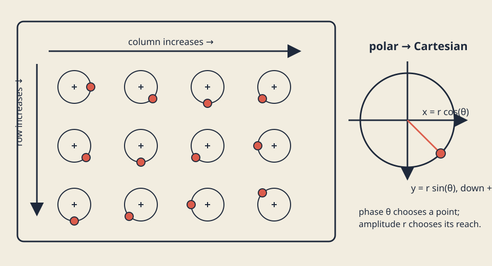

# Oscillation, circles, and phase

## Look



*Nested rows and columns repeat one circular rule while phase offsets create a traveling rhythm.*

The preview is static and has no audio. Outlined paths, crosshair centers, filled
travelers, labels, and position—not color alone—explain the field.

## Predict

A point starts at angle `0` with radius `10`. Predict its `(x,y)` at `0`,
`pi/2`, `pi`, and `3*pi/2`. In openFrameworks' positive-down y coordinates,
which quarter-turn points downward? Then predict whether adding `2*pi` changes
the position.

## Learn

### Name the constants

A full circle is 360 degrees, `2*pi` radians, or one turn. Do not scatter
rounded `3.14` values through a program. Give the relationships names:

```cpp
constexpr float pi = 3.14159265358979323846f;
constexpr float tau = 2.0f * pi;
constexpr float fixed_dt = 1.0f / 60.0f;
```

`constexpr` says these values are available during compilation and cannot be
changed accidentally. `tau` makes “one full turn” visible in formulas.
`fixed_dt` makes each update an inspectable sixtieth of a second.

### Degrees are for conversation; trig functions take radians

Degrees are often easier to sketch. C++ trigonometric functions use radians:

```text
radians = degrees * pi / 180
degrees = radians * 180 / pi
```

Thus 90 degrees is `pi/2`, 180 is `pi`, and 360 is `tau`. The course model
keeps `degreesToRadians()` and `radiansToDegrees()` explicit so tests can check
both directions. Non-finite conversion input returns zero by policy rather
than passing NaN into geometry.

### Cosine and sine trace a circle

For radius `r` and angle `theta`:

```text
x = r * cos(theta)
y = r * sin(theta)
```

At angle zero, `(cos,sin)` is `(1,0)`. At `pi/2` it is `(0,1)`; in the usual
openFrameworks window, positive y points **down**. The other cardinal points
are `(-1,0)` at `pi` and `(0,-1)` at `3*pi/2`.

[`std::sin`](https://en.cppreference.com/w/cpp/numeric/math/sin.html) and
`std::cos` repeat after `2*pi`. Floating-point results near a cardinal zero may
be a tiny value such as `-4e-8`, so tests compare approximately rather than
requiring exact zero.

### Polar coordinates separate reach from direction

Cartesian coordinates store `(x,y)`. Polar coordinates store radius and angle:

```cpp
struct Polar { float radius; float angle_radians; };
Vec2 offset = polarToCartesian({radius, angle});
Vec2 point{center.x + offset.x, center.y + offset.y};
```

Radius is reach; angle is direction around the circle. Negative radius is
outside this lesson's contract and maps to zero. To go back:

```text
radius = hypot(x, y)
angle = atan2(y, x)
```

Unlike `atan(y/x)`, [`std::atan2`](https://en.cppreference.com/w/cpp/numeric/math/atan2.html)
uses signs from both components and distinguishes all four quadrants. Its
signed answer is normally in `[-pi, pi]`: down-left is positive `3*pi/4`, while
up-left is negative `-3*pi/4` in screen coordinates.

The zero vector has radius zero but no unique direction. Our explicit policy is
`cartesianToPolar({0,0}) == {0,0}`. Never normalize or divide to invent an
angle there. Tests cover all quadrants, the zero policy, and polar-to-Cartesian
round trips.

### Amplitude, frequency, phase, and period

A sine wave can be written:

```text
value = amplitude * sin(tau * frequency * time + phase)
```

- **Amplitude** is maximum displacement from the center.
- **Frequency** is cycles per second, measured in hertz.
- **Period** is seconds per cycle: `period = 1 / frequency`.
- **Phase** shifts where a cycle begins without changing amplitude or period.

For amplitude 7 and frequency 2 Hz, the period is 0.5 seconds. At a quarter
period (`0.125` seconds), sine reaches amplitude 7. Adding `tau` to phase does
not change the value. Adding one period to time does not change it either.
Those are testable periodicity contracts, not just visual impressions.

The model rejects negative amplitude/frequency in its general `oscillate()`
helper. Exercise designs use positive frequency from `0.05`–`2` Hz so every
field has a defined finite period.

### Nested loops make a field

One loop walks rows; an inner loop walks columns:

```cpp
for (int row = 0; row < rows; ++row) {
    for (int column = 0; column < columns; ++column) {
        int index = row * columns + column;
        // make exactly one mark
    }
}
```

A 3-by-4 field makes 12 marks with indices 0 through 11. The mark at row 1,
column 2 has index `1*4+2 = 6`. Row and column are not interchangeable:
columns control horizontal spacing, while rows control vertical spacing.
`flatIndex()` returns `-1` for invalid coordinates instead of indexing memory.

Each field mark receives a phase:

```text
phase = tau * frequency * time
      + row * row_phase_step
      + column * column_phase_step
```

Then `polarToCartesian({amplitude, phase})` supplies a circular displacement
around that mark's base. The same rule repeats; row/column offsets make a wave
seem to travel through the field. No randomness or frame-clock lookup exists
inside the model.

### Deterministic time at the renderer boundary

The openFrameworks adapter advances `time_seconds` by `fixed_dt` in `update()`
and passes it to pure `makeScene()`. Space or `P` pauses; `R` resets through
[`keyPressed`](https://openframeworks.cc/documentation/application/ofBaseApp/#!show_keyPressed).
Those controls offer a keyboard-operable way to inspect exact phases.

This fixed update is intentionally introductory. If rendering stalls, visual
time slows instead of silently taking a giant step. The standard-library C++17
model accepts an explicit time, so identical inputs replay identically on
Linux, macOS, and Windows. Native compilation does not prove that a graphical
runtime was launched.

### Keep strokes inside tiny viewports

Visible bounds include mark radius and half the 3-pixel stroke, plus a 2-pixel
outer margin. A base point also reserves the full amplitude so its traveler can
move in any direction:

```text
base inset = amplitude + mark radius + 1.5 + 2
mark inset = mark radius + 1.5 + 2
```

Base positions are evenly interpolated between opposite base insets. Even in a
valid `64 x 64` viewport, every traveler's stroke remains inside. A viewport
smaller than `64` in either dimension, invalid design, or non-finite time
returns `Scene{valid=false}`. Validation checks each base and its full orbit or
capped crosshair extent as well as each traveler center and mark extent. Tests
also calculate the circle, crosshair, and diamond extrema independently under
minimum and maximum learner parameters; they do not compare pixels.

### Learner-owned design, shared safety

`Design` owns rows, columns, amplitude, frequency, row/column phase steps, mark
radius, and palette. These choices change count, geometry, rhythm, and color.
The shared model owns conversion rules, indexing, phase math, bounds, and
invalid-input policy. Public tests compile the starter's
`makePhaseFieldDesign()`, so an out-of-range learner choice produces an
actionable failure.

The starter uses orbit outlines, crosshairs capped at the mark radius, and
filled circular travelers. The explained solution uses connected row threads
and alternating filled/outlined diamonds drawn from four axis vertices exactly
one mark radius from the center. A successful learner result should make a
third spatial or shape relationship rather than recolor either one.

### Approximate tests, independent oracles

The fixture contains hand-calculated values for a 3-by-4 field: viewport,
time, row, column, flat index, base, phase, and center. Its reader requires
exactly twelve fields per data row. Tests report actual, expected, difference,
absolute tolerance `0.002`, and relative tolerance `0.000001`.

Properties also check conversion, four cardinal points, four `atan2` quadrants,
zero policy, wave parameters, count/order, phase and time periodicity,
determinism, parameter variation, non-finite policy, and tiny/stroke bounds.
There is no screenshot target or pixel gate.

## Try the calculations

1. Convert 90 degrees: `90*pi/180 = pi/2` radians.
2. Convert `pi` radians: `pi*180/pi = 180` degrees.
3. Radius 10 at `pi/2`: `(10*cos(pi/2), 10*sin(pi/2)) ≈ (0,10)`.
4. Cartesian `(-3,4)`: radius `5`; `atan2(4,-3)` lies in quadrant two.
5. For amplitude 6, frequency 0.5 Hz: period is `2` seconds.
6. In 5 rows by 7 columns, count is `35`; row 3, column 2 has index `23`.

Sketch the circle and grid before running code. The diagram explains direction;
the numbers verify conversions and indexing; the tests verify repetition and
bounds.

## Break and repair

In the exact tracked file
`exercises/05-oscillation-circles-and-phase/shared/phase_field_model.cpp`,
temporarily change:

```cpp
polar.radius * std::sin(polar.angle_radians)
```

to:

```cpp
polar.radius * std::cos(polar.angle_radians)
```

Run `tests/run-section-05-tests.sh`. Predict which cardinal, quadrant
round-trip, fixture-center, and periodic properties fail. Read the component
diagnostics, restore sine for y, and rerun. If this was your only intended edit:

```sh
git restore -- exercises/05-oscillation-circles-and-phase/shared/phase_field_model.cpp
```

That command discards every uncommitted change in the named file. Record the
failure, the circle-coordinate explanation, and the repaired result.

## Exercise

Open the [phase-field brief](../../../exercises/05-oscillation-circles-and-phase/README.md).
Edit exactly
`exercises/05-oscillation-circles-and-phase/starter/src/design/phase_field_design.cpp`
first. Choose valid grid, amplitude, frequency, row/column phase, radius, and
palette values. Then edit `starter/src/ofApp.cpp` to create learner-owned marks
and relationships while retaining pause/reset controls and pure model calls.

Do not copy the starter or solution and only change colors. Consider arcs,
short directional strokes, paired marks, alternating scales, or negative-space
bands. Predict count, first two phases, period, and maximum extent before
building.

## Test

On Linux or macOS, use both available compilers:

```sh
CXX=g++ tests/run-section-05-tests.sh
CXX=clang++ tests/run-section-05-tests.sh
```

On Windows Developer PowerShell:

```powershell
.\tests\run-section-05-tests.ps1
```

Generate and compile starter and solution in Debug and Release before a
release claim. Launch manually at `64 x 64`, narrow, square, and wide sizes;
pause, resume, reset, and watch a complete period. Pure Linux/Windows runners
and native Linux/macOS/Windows CI prove their named numerical/compilation
contracts only. They do not prove graphical runtime, accessibility, contrast,
or originality.

## Reflect

In 120–160 words, explain radians, `(cos,sin)` circular motion, amplitude,
frequency, period, phase, polar coordinates, the `atan2` quadrant advantage and
zero policy, nested row/column indexing, one periodicity property, one
stroke-aware bound, and one learner-owned visual choice. Include alt text for
one capture.

## Remix

Keep the model contract but change a relationship: map row to amplitude, use
alternating frequency signs in your renderer, connect equal-phase neighbors,
or draw only marks near a cardinal direction. Predict cardinal, periodic,
count, and boundary consequences before editing.

## Manual review

- Pause/resume/reset work by keyboard, and no pattern flashes.
- Mark roles and phase relationships remain understandable without color alone.
- Ink/background and accent/background contrast are suitable.
- Geometry remains legible at narrow, square, wide, and `64 x 64` sizes.
- Geometry or spatial behavior differs from starter and solution, not only palette.
- Capture alt text names the grid, phase direction, shape encoding, and viewport.
- Reused code and assets remain credited and license-compatible.

## Pilot note

Pilot evidence not yet collected. After a learner completes this section,
record exact platform/tool versions; reading, calculation, repair, exercise,
and reflection time separately; setup and keyboard friction; whether radians,
cardinal sine/cosine, amplitude/frequency/phase/period, polar conversion,
`atan2` quadrants/zero policy, nested indexing, periodicity, bounds, and
approximate tolerances were understood; automated test outcome; manual
accessibility/originality review; and points of confusion. Do not infer learner
timing from CI or author tests.
