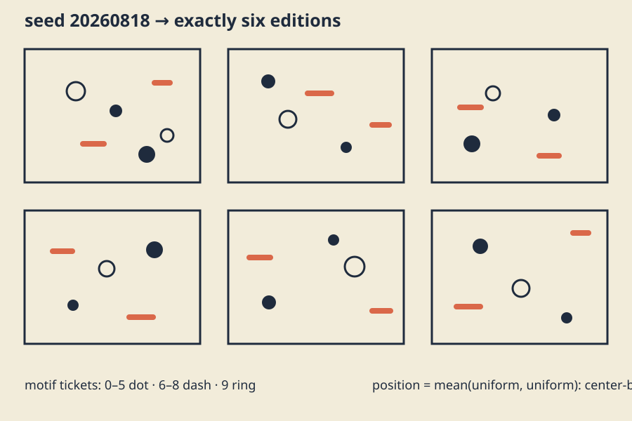

# Controlled chance

## See what you're making



*One seed generates six related editions; shape and position distinguish motifs without relying on color.*

The preview is static, has no audio, and encodes motif by shape as well as color.

## Take a guess

A ten-ticket choice gives tickets 0–5 to dots, 6–8 to dashes, and 9 to rings. Predict
the proportions and the result for tickets 5, 6, 8, and 9. Then compare one uniform
value with the average of two uniform values: which rule places more marks near the middle?

## Let's unpack it

### Before the randomness vocabulary

A computer's random-number generator is more like a very elaborate card shuffle than
magic. A **seed** chooses the starting shuffle. Use the same seed and the same rules,
and you get the same sequence again. That repeatability lets a test recreate an image
even though the image looks varied.

A **distribution** is the rule for choosing from the sequence. A uniform rule gives
every choice the same chance. A weighted rule makes some choices more common than
others. You will use those rules as visual design tools, not prove probability theorems.

### Engine, seed, and distribution have different jobs

A random **engine** is a repeatable state machine that emits integers. A seed selects
its initial state:

```cpp
std::mt19937 engine(seed);
```

The standard specifies the `std::mt19937` engine algorithm and state sequence; see
[`std::mersenne_twister_engine`](https://en.cppreference.com/w/cpp/numeric/random/mersenne_twister_engine.html). The output looks irregular, but the same initial engine state repeats.
It is pseudo-random, not secret and not entropy.

A **distribution** maps engine output into useful values. The model creates a
[`std::uniform_real_distribution<float>`](https://en.cppreference.com/w/cpp/numeric/random/uniform_real_distribution.html) for normalized positions and radii. “Uniform” means equal-length
intervals are intended to receive equal probability, not that a small image must contain
an even grid.

This distinction matters for reproducibility: the standard engine sequence is specified,
while a standard distribution's exact mapping algorithm is not required to match every
C++ library implementation. Two builds may consume or map engine values differently even
with the same seed.

### Reproducibility has explicit levels

This section uses three clear promises:

1. **Concept replay:** seed and algorithm explain the same process.
2. **Same-build replay:** same source, compiler/library build, parameters, and seed
  produce exactly the same serialized model text. `R` demonstrates this.
3. **Cross-toolchain parameter replay:** save `CONTROLLED_CHANCE_V1` text so tests,
  another adapter, or code you add can parse those generated records without running a
  random distribution again. The supplied starter saves this file but does not load it.

A seed alone cannot promise the same choices from every compiler's random library. Save
the generated choices when another person must recreate the exact result or when you
want to return to it much later. The adapter uses [openFrameworks file utilities](https://openframeworks.cc/documentation/utils/ofFileUtils/) when `S`
writes `edition-parameters.txt`.

This one standard text format stores a version, seed metadata, exactly six ordered
editions, mark count, normalized x/y, radius, and motif code. It uses the classic locale
and enough decimal digits to round-trip each `float`. The parser rejects wrong
versions, missing or extra records, `NaN` or infinite values, unknown motifs,
bad ranges, and noncontiguous edition indices.

### Simple records separate chance from drawing

The model does not draw while sampling:

```cpp
struct MarkParameter {
    float x_unit;
    float y_unit;
    float radius;
    Motif motif;
};
struct Edition {
    int index;
    std::vector<MarkParameter> marks;
};
```

First generate records; then serialize, test, or render them. This seam lets a fixture
provide parameters independently of an engine. It also lets another toolchain parse the
exact edition without pretending its distributions match.

### Uniform choice and weighted choice

A radius uses a uniform real distribution between the minimum and maximum
radii you choose.
Motifs use an integer ticket drawn with [`std::uniform_int_distribution<int>`](https://en.cppreference.com/w/cpp/numeric/random/uniform_int_distribution.html) from 0 through 9, followed by an
explicit table:

```text
0 1 2 3 4 5 -> dot   (six tickets)
6 7 8       -> dash  (three tickets)
9           -> ring  (one ticket)
```

This is weighted choice without hidden magic. `weightedMotif()` is tested over all ten
tickets and must map exactly six to dot, three to dash, and one to ring. Generator
integration checks exact counts and legal motifs, but does not treat a small random
sample's histogram as a portable oracle.

### Distributions are design shapes

A single uniform coordinate spreads marks evenly in expectation. This lesson uses the
average of two uniform draws:

```text
center_biased = (uniform_a + uniform_b) / 2
```

Few pairs average near 0 or 1; many average near 0.5. The result is a triangular
probability shape with more central marks. The public test uses every pair on a fixed
0.0–1.0 grid and counts center versus tail values. That repeatable calculation cannot
fail because of a lucky or unlucky random sample.

Distributions should answer a compositional question. Uniform radius gives a flat size
range; weighted motifs establish hierarchy; center-biased positions create a dense
middle and quieter edges. Change those rules only when you can name the intended shape.

### Exactly six images, not six reruns by hand

One outer loop creates indices 0 through 5. Each edition receives the same number of
records from one continuing engine state. The result is a family: shared rules, distinct
parameters. Tests require exactly six editions, contiguous indices, exact per-edition
counts, legal normalized positions, finite radii, and known motif codes.

Changing the seed must alter many generated records, not only seed metadata. Within one
build, the same seed is compared through that standard saved text. Neither test inspects
pixels.

### Stroke-aware responsive panels

Normalized coordinates are mapped into each panel only after generation. The inset
reserves the largest record radius, half of the 3-pixel stroke, and a 2-pixel outer
margin:

```text
inset = maximum radius + 1.5 + 2
center = inset + unit * (viewport dimension - 2*inset)
```

Circles, horizontal or vertical dashes, rings, and the solution's axis-aligned squares
have extrema no farther than one radius from their center. Tests calculate those extrema
independently for all six fixture editions at square, narrow, wide, and `64 x 64`
panel sizes. A panel smaller than 64 in either dimension is explicitly invalid.
`NaN` or infinite parameters never enter a scene.

### Your composition and palette

`Design` owns the seed, marks per edition, radius range, and three-color palette.
The starter draws framed samples with filled dots, horizontal dashes, and circular
rings. The explained solution connects record order into routes and uses filled squares,
vertical cross-stems, and square outlines. Create a third grammar—perhaps bands, paired
marks, cut-paper clusters, or a typographic constellation—not a recolor.

The tests compile the starter's `makeEditionDesign()`, so invalid choices receive a direct diagnostic. Contrast and resemblance still require human review; a numerical
model cannot prove either.

## Try the numbers

1. Ten motif tickets assign probabilities of 60%, 30%, and 10%—the same as
  `0.6`, `0.3`, and `0.1`.
2. Tickets 5, 6, 8, and 9 map to dot, dash, dash, and ring.
3. Uniform inputs 0.2 and 0.8 average to 0.5.
4. With maximum radius 8, inset is `8 + 1.5 + 2 = 11.5` pixels.
5. Six editions with 20 marks each contain 120 records.
6. Seed plus source is enough for same-build replay; portable parameters are required by
  this lesson's cross-platform rule.

## Break it on purpose

In `exercises/06-controlled-chance/shared/edition_model.cpp`, temporarily change:

```cpp
if (ticket >= 0 && ticket < 6) return Motif::dot;
```

to:

```cpp
if (ticket >= 0 && ticket < 5) return Motif::dot;
```

Run `tests/run-section-06-tests.sh`. Predict the ticket-boundary and exact six/three/one mapping
diagnostics, then restore `< 6` and rerun. If this was your only intended edit:

```sh
git restore -- exercises/06-controlled-chance/shared/edition_model.cpp
```

That command discards every uncommitted change in the named file. Before moving on, make
sure you can connect the failure to the ticket table.

## Your turn

Open the [six-image edition brief](../../../exercises/06-controlled-chance/README.md). Edit `starter/src/design/edition_design.cpp` first. Predict your 6/3/1 hierarchy,
position density, radius range, and 3-by-2 panel behavior. Then create your geometry in
`starter/src/ofApp.cpp` while keeping exactly six editions and `R`, `N`,
and `S` keyboard controls.

Use the same seed to inspect a revision, a new seed to explore variation, and a saved
parameter file to identify a chosen edition. Do not repeatedly reseed from the clock
until something attractive appears; that erases the experiment.

## Check your work

On Linux or macOS:

```sh
CXX=g++ tests/run-section-06-tests.sh
CXX=clang++ tests/run-section-06-tests.sh
```

On Windows Developer PowerShell:

```powershell
.\tests\run-section-06-tests.ps1
```

Generate and compile starter and solution in Debug and Release. Launch manually, press
`R`, `N`, and `S`, inspect the saved parameter text, and inspect all six panels at
minimum, narrow, square, and wide sizes. The tests exercise the parser; the supplied app does not load the file unless you add
that route. Open the app yourself to check the window, contrast, controls, and visual
choices; the number tests and build cannot see them.

## Optional notes for future you

Explain the difference between a seed and a distribution, then describe one weighted or
center-biased choice in your picture. Note what the saved parameter file contains and
name one visual relationship you chose. Save a six-panel capture with alt text.

## Make it yours

Keep the saved parameter schema but change how records become marks. Sort by x before
connecting, pair rare rings with nearest dots, map radius to line count, or use
negative-space windows. Predict which generated invariants stay fixed and which
renderer-only relationships change.

## Quick visual check

- `R`, `N`, and `S` work by keyboard, and no panel
  flashes.
- Dot, dash, and ring roles remain distinguishable without color alone.
- Ink/background and accent/background contrast are suitable.
- Exactly six panels remain legible at narrow, square, wide, and minimum sizes.
- Geometry or spatial relationships differ from starter and solution, not only palette.
- Capture alt text names six images, density shape, motif encoding, and palette role.
- A saved parameter file records the exact inspected model for tests or a loader you
  add; reused work is credited.

## If you get stuck

If a random sketch changes every time, print the seed and check that the model uses the
seeded engine—not a surprise global generator. If every result looks the same, check
that you are actually drawing the generated values. Randomness is seasoning, not a
substitute for choosing a composition.
