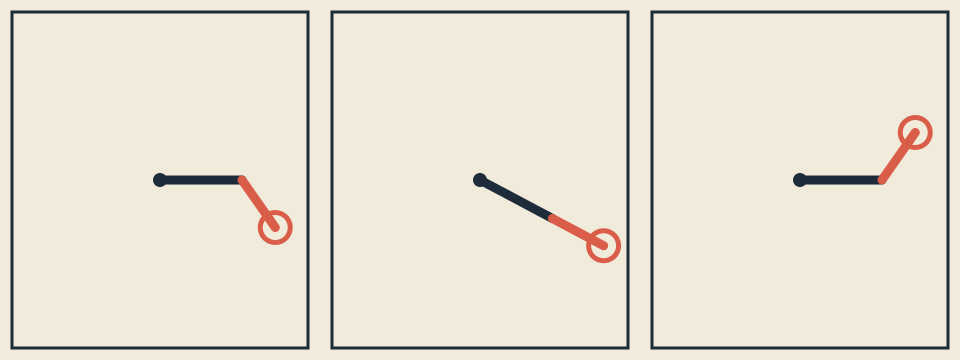

# Local coordinate systems

## See what we're making



*One hierarchy at three times: each child anchor inherits its parent's local coordinate system.*

The preview is static, has no audio, and identifies levels by shape and position as well
as color.

## Take a guess

Put a point at local `(1, 0)`. Compare these two recipes:

1. rotate 90 degrees, then translate 10 pixels right;
2. translate 10 pixels right, then rotate 90 degrees.

Sketch both results before running a test. On an openFrameworks screen, where positive y
points down, which visual direction does a positive 90-degree turn move a right-pointing
vector?

## Let's unpack it

### Before the transform vocabulary

A child shape is often easier to place relative to a parent than relative to the whole
window. “Put the small arm 40 pixels from the end of the large arm” stays useful when
the large arm moves or rotates. That relative measuring space is a **local coordinate
system**.

`ofPushMatrix()` saves the current measuring space. Translation, rotation, and scale
change it. `ofPopMatrix()` restores the saved one. You can picture this as putting a
transparent sheet over the drawing, moving or turning the sheet, drawing on it, then
removing it.

### Local coordinates turn placement into a relationship

A local point describes where something is relative to a nearby origin. The child arm
begins at `(0, 0)` in its own coordinate system and ends at `(second_length, 0)`. It
does not need the window center or its parent's angle. The parent transform carries that
simple geometry into the world.

This makes a hierarchy readable:

```text
viewport center and fit
  -> parent rotation
    -> first-arm translation
      -> child rotation
        -> child endpoint
```

Changing the parent moves every descendant. Changing the child affects only that child
branch. Small helper objects and pure transform functions keep those responsibilities
visible.

### Lexical scope is a visible boundary

Names declared inside a `{ ... }` block have block scope; see C++ [scope](https://en.cppreference.com/w/cpp/language/scope.html).
Use that same visual boundary for a temporary coordinate system:

```cpp
{
    MatrixScope child_scope;
    ofTranslate(first_length, 0.0f);
    ofRotateDeg(child_angle);
    drawChildInLocalCoordinates();
}
```

The child transform cannot accidentally become the next sibling's starting point. A
helper should accept only what it needs: a length, a radius, or a scene record—not the
whole app by default.

### Narrow RAII intuition: balance push and pop

`MatrixScope` calls `ofPushMatrix()` in its constructor and `ofPopMatrix()` in its
destructor. C++ runs that destructor when control leaves the block, even through an
early `return`. This is the useful intuition behind RAII here: enter a scope,
acquire one temporary graphics state; leave it, restore that state. The language rules
for [destructors](https://en.cppreference.com/w/cpp/language/destructor.html) explain the mechanism.

The guard deletes copying so one push cannot produce two pops. This lesson does not add
pointers, dynamic allocation, or an ownership hierarchy. It applies a small stack object
to one balanced graphics operation. The openFrameworks [graphics reference](https://openframeworks.cc/documentation/graphics/ofGraphics/) documents
`ofPushMatrix`, `ofPopMatrix`, `ofTranslate`, `ofRotateDeg`, and `ofScale`.

### Translation, rotation, and scale each change a frame

- `translation(x, y)` moves the origin.
- `rotationDegrees(angle)` turns both local axes around the origin.
- `scaling(x, y)` changes the size and orientation of those axes.

The public model uses three-by-three matrices for 2D points. You do not need a matrix
course to use them. Imagine each point as `(x, y, 1)`: the extra `1` lets
translation live in the same table as rotation and scale. Matrix multiplication then
composes a chain into one transform.

The homogeneous `1` is bookkeeping, not another visible dimension. Tests ask
whether known points land correctly, not whether you can multiply every table by hand.

### Positive-down coordinates change visual rotation language

The model uses:

Here `x'` and `y'` mean “new x” and “new y”:

```text
new x = cos(angle)*x - sin(angle)*y
new y = sin(angle)*x + cos(angle)*y
```

`rotationDegrees()` accepts degrees and converts them to radians before calling sine
and cosine. At positive 90 degrees, `(1, 0)` becomes `(0, 1)`. In a mathematical positive-up graph that points upward; on the
openFrameworks screen positive y points down, so it looks clockwise. State whether you
mean numeric sign or visual direction when discussing rotation.

### Transform order is not commutative

With column-style points, `parent * local * point` applies the rightmost operation first.
Therefore:

```text
translation(10, 0) * rotation(90) * point(1, 0) = (10, 1)
rotation(90) * translation(10, 0) * point(1, 0) = (0, 11)
```

The same operations produce different positions because rotation changes the direction
of the translated axis. Transform functions do not commute. A visual transform reference
such as MDN's [transform guide](https://developer.mozilla.org/en-US/docs/Web/CSS/CSS_transforms/Using_CSS_transforms) shows the same broad composition idea, though this
exercise's C++ model and openFrameworks command order are the authority for its exact
rule.

In the adapter, calling translate, scale, then rotate under one pushed matrix makes
local geometry rotate first, scale next, and move to the panel last. The pure model
writes that chain explicitly as matrix multiplication.

### Save parent-child points so tests can check them

The first arm's world transform is:

```text
root = viewport_translation * responsive_scale * parent_rotation
```

The child inherits it:

```text
child = root * first_arm_translation * child_rotation
```

`transformPoint(root, {first_length, 0})` gives the elbow. `transformPoint(child, {second_length, 0})` gives the tip. The tests compare those
values with a hand-calculated, strictly parsed three-row fixture at time 0, one-quarter
period, and one-half period. Rendering uses the same hierarchy, but no screenshot
decides correctness.

### Motion is repeatable and periodic

Parent angle uses sine; child angle uses cosine. Time is wrapped into `[0, period)`,
including negative time. `NaN` or infinite time maps to zero. Identical inputs
yield identical anchors, and adding one period yields the same scene. The three
displayed frames are fixed samples, not three independent animations.

### Decide how scale and window limits work

A finite zero scale is legal in the matrix helper and deliberately collapses an axis. A
scale containing `NaN` or infinity returns the unchanged point instead of
spreading a bad value through a scene. Learner `Design` lengths, period, radius,
and stroke must remain positive and finite; colors remain 0–255.

A viewport smaller than `48 x 48` is invalid. Legal scenes fit total arm reach and
ornament radius inside half of the smaller dimension, reserving half the stroke width
plus a two-pixel margin. Tests independently inspect pivot, elbow, and tip extrema for
tiny, narrow, wide, and large viewports. This is a conservative anchor-and-ornament
bound, not a pixel test.

### You choose the shapes, colors, and motion

The starter uses stroked rods, a filled pivot, and a ring. The explained solution uses
filled triangular ribbons, a square crossbar, counter-motion, and a dark palette. Own
arm proportions, swing relationship, period, palette, and a third geometric language.
Balanced transforms and public invariants are constraints; resemblance is not a goal.

Automated tests cannot prove contrast, hierarchy legibility, or originality. Those
remain manual review items.

## Make it run: inspect a transform chain

### 1. Calculate before compiling

Write these predictions in your notes; they become the known cases you run in step 2.

1. Identity leaves `(3, -2)` unchanged.
2. Translating that point by `(7, 4)` gives `(10, 2)`.
3. Positive 90-degree rotation maps `(2, 0)` to `(0, 2)`, visually downward.
4. Scale `(2, 3)` maps `(4, -2)` to `(8, -6)`.
5. Parent translation affects both elbow and tip; child rotation affects tip but not
  elbow.
6. A four-second period makes times `0.75` and `4.75` equivalent.

For transform order, calculate both chains from **Predict**: rotation then translation
lands at `(10, 1)`, while translation then rotation lands at `(0, 11)`. Say
which operation is rightmost in each matrix product.

### 2. Run the chain and inspect its anchors

From the repository root on Linux or macOS, run exactly:

```sh
cat exercises/07-local-coordinate-systems/fixtures/transformed-anchors.txt
CXX=g++ tests/run-section-07-tests.sh
```

The first command exposes the independent three-frame oracle. Confirm the `start`
row shows pivot `(160, 120)`, elbow `(222.97297, 120)`, and tip `(245.01351, 158.17529)`. The test
command runs your primitive calculations, both transform orders, those three
parent-child anchor rows, period replay, and independent viewport extrema. It ends with
`sculpture_model_test: ... passed`. On Windows Developer PowerShell, the equivalent exact commands are:

```powershell
Get-Content .\exercises\07-local-coordinate-systems\fixtures\transformed-anchors.txt
.\tests\run-section-07-tests.ps1
```

### 3. Build and observe the same hierarchy

Set `OF_ROOT` to your complete openFrameworks 0.12.1 directory, then on Linux run:

```sh
export OF_ROOT=/absolute/path/to/of_v0.12.1_linux64_gcc6_release
scripts/section-07.sh generate --project starter
scripts/section-07.sh build --project starter --configuration Release
exercises/07-local-coordinate-systems/starter/bin/starter
```

On Windows Developer PowerShell, use:

```powershell
$env:OF_ROOT = 'C:\absolute\path\to\of_v0.12.1_vs_64_release'
.\scripts\section-07.ps1 generate --project starter
.\scripts\section-07.ps1 build --project starter --configuration Release
& .\exercises\07-local-coordinate-systems\starter\bin\starter.exe
```

The window must show exactly three frames. In each frame, identify the pivot, elbow, and
ornament tip from the shape hierarchy—not color alone. Resize the window and check that
all three anchors stay visible. The app shows the finished drawing; the printed example and pure test check the
underlying numbers.

## Break it on purpose

In `exercises/07-local-coordinate-systems/shared/sculpture_model.cpp`, temporarily reverse this composition:

```cpp
multiply(scene.root_transform, translation(design.first_length, 0.0f))
```

so translation appears on the left. Run `tests/run-section-07-tests.sh` and predict which elbow or
child-tip fixture checks fail. Restore the exact line and rerun. If this was your only
intended edit:

```sh
git restore -- exercises/07-local-coordinate-systems/shared/sculpture_model.cpp
```

That command discards every uncommitted change in the named file. Before moving on, make
sure you can connect the failed anchor to transform order.

## Your turn

Open the [three-frame sculpture brief](../../../exercises/07-local-coordinate-systems/README.md). Edit `starter/src/design/sculpture_design.cpp`, predict all three poses, then create your
local geometry in `starter/src/ofApp.cpp`. Keep exactly three phases and a `MatrixScope` around
every pushed transform. Resize across tiny, narrow, square, and wide windows and explain
what is inherited at each hierarchy level.

## Check your work

On Linux or macOS:

```sh
CXX=g++ tests/run-section-07-tests.sh
CXX=clang++ tests/run-section-07-tests.sh
```

On Windows Developer PowerShell:

```powershell
.\tests\run-section-07-tests.ps1
```

Generate and compile starter and solution in Debug and Release. Open them and inspect
all three frames at tiny, narrow, square, and wide sizes. The tests and compiler cannot
judge the visible result, contrast, controls, or your design choices.

## Optional notes for future you

Explain local versus world coordinates in your own words, then show one parent-child
anchor calculation. Name one visual relationship you created, and save a three-frame
capture with alt text.

## Make it yours

Add a third hierarchy level, mirror one branch with a negative finite scale, or attach
several ornaments to one parent. Predict which anchors inherit each change before
editing. Keep each helper local and every matrix scope balanced.

## Quick visual check

- No frame flashes, and the static three-frame comparison needs no audio.
- Parent, child, pivots, and ornaments remain distinguishable without color alone.
- Ink/background and accent/background contrast are suitable.
- Exactly three frames remain legible at tiny, narrow, square, and wide sizes.
- Geometry and spatial relationships differ from starter and solution, not only palette.
- Capture alt text names phases, hierarchy, motion, shape encoding, and palette roles.
- Reused references are credited and matrix state does not leak between frames.

## If you get stuck

When a child arm goes somewhere surprising, freeze time and inspect one anchor at a
time. Check the order of translate → rotate → scale, and make sure every push has a
matching pop. Transform bugs are often just a tiny stack of instructions wearing a fake
mustache.
