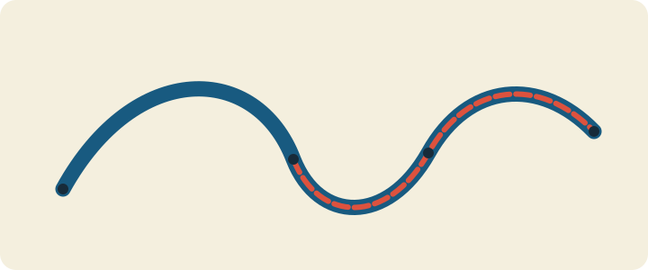

# Gesture as geometry

## See what we're making



*Sampled movement becomes width, turning color, and inspectable geometry.*

The preview is static and uses width, dashes, and anchor dots as well as color.

## Borrow the idea, not the artwork

Use the course's [credited precedent notes](../../../docs/source-notes.md#visual-vocabulary)
to study gesture as sampled geometry, not as a target composition. In your
process note, name the creator and collaborators, state the transferable
sampling or response principle, and change the input, mark construction,
mapping, motion, and composition rather than reproducing a familiar still.

## Take a guess

A pointer reports `(0,0)`, `(10,0)`, then `(10,10)`, one second apart. With no
filter and `k = log(2)`, predict each smoothed point, second-sample velocity,
signed turn at the third point, and cumulative smoothed length. Now insert a
duplicate point and a zero-time step: which divisions must be guarded?

## Let's unpack it

### Events report observations; the model defines a gesture

The openFrameworks [event reference](https://openframeworks.cc/documentation/events/ofEvents/)
describes mouse and keyboard events. `ofApp` converts either route into a point
and time, clamps stroke centers inside the window, then calls `addSample`. If either
window dimension is smaller than the full maximum stroke width, capture is
suppressed and the cursor stays centered; this avoids constructing an inverted
clamp interval.
Filtering, smoothing, pruning, velocity, curvature, and length do not call
openFrameworks. This input/model separation lets standard C++ tests replay the
same observations without a window.

Drag to sample with a pointer. Arrow keys move a visible fallback cursor and
sample the same model; C clears it. There is no automatic animation, flashing,
or audio. Every visible change follows deliberate input, so there is no hidden
motion mode for a reduced-motion setting to disable.

### A vector has size and capacity

`std::vector<Sample>` stores a contiguous sequence and grows as needed; consult
[`std::vector`](https://en.cppreference.com/w/cpp/container/vector.html). `size()`
is the number of live samples. `capacity()` is storage available before another
allocation may be needed. `push_back` grows size; `erase(begin())` removes the
oldest item; `clear()` makes size zero but does not promise to release capacity.
Never index an empty vector, and do not keep pointers or references across an
operation that may grow or erase it.

This exercise filters before growth and prunes after growth:

```cpp
if (distance(last.raw, raw) < minimum_distance) return false;
samples.push_back(next);
if (samples.size() > maximum_samples) samples.erase(samples.begin());
```

The production code erases all excess in one range. A deque could make
front-pruning cheaper, but vector is retained here to teach the common
contiguous container and because the cap is explicit. Capacity is performance
intuition, not visible output or a correctness value.

### Minimum-distance filtering rejects event noise

Mouse systems may report many near-identical positions. Compare the new raw
point with the last accepted raw point. Reject it when the Euclidean distance
is strictly less than the learner-owned threshold; equality is accepted. This
occurs before smoothing so a rejected event cannot change time, length, or
velocity. A zero threshold accepts duplicates; later degenerate guards keep them safe.

### Exponential smoothing must include time

A fixed per-frame blend changes when frame rate changes. Instead use

```text
alpha = 1 - exp(-k * dt)
smoothed = current + alpha * (target - current)
```

This is an exponential weighting idea related to
[exponential smoothing](https://en.wikipedia.org/wiki/Exponential_smoothing),
but the formula above is the exact lesson contract. For a constant target, one
one-second step and two half-second steps agree within floating-point tolerance.
Larger `k` follows input more quickly.

The invalid-time policy is explicit: non-finite, zero, or negative `dt` leaves
the smoothed position unchanged and produces zero velocity. The stored time
also remains at the last valid time. Non-finite points and timestamps are
rejected. This prevents NaN from spreading and prevents division by zero.

### Velocity needs displacement and elapsed time

Velocity is `(current - previous) / dt`; speed is its magnitude. The zero-time,
negative-time, and non-finite-time guard returns `(0,0)`. A learner mapping
makes slow samples wide and fast samples narrow, clamped to a declared width
range. That direction is a design choice, not a physical law—own it and explain it.

### Turning angle is local curvature evidence

For incoming vector `a` and outgoing vector `b`:

```text
signed_turn = atan2(cross(a,b), dot(a,b))
```

A straight continuation is zero. In positive-down screen coordinates, a turn
from rightward to downward is positive `pi/2`; the opposite is negative. The
unsigned amount is `abs(signed_turn)`. If either segment has near-zero length,
return zero rather than normalizing or inventing a corner. The exercise maps
unsigned turn amount to palette, while the signed value remains inspectable.
Width and facet/dot shape still communicate change without color alone.

### Arc length adds segment distances

Cumulative arc length starts at zero. Each accepted sample adds the distance
between consecutive smoothed positions. It measures travel along the polyline,
not straight-line displacement from the start. Tests compare every cumulative
row against a separately stored, strictly parsed oracle.

### Uniform resampling walks distance, not event count

Event density depends on hardware and hand speed. Uniform arc-length resampling
first removes exact consecutive duplicate and non-finite points, builds cumulative
segment lengths, then interpolates points at `spacing * i` using an integer
index (rather than repeatedly adding a float). Near-but-distinct endpoints stay
distinct. Spacing below `0.001` or a result above 100,000 points is rejected with
an empty result before allocation; these declared limits keep output and
`reserve` bounded. It always preserves the first and final distinct endpoints. Empty and single
input stay empty/single. A path shorter than spacing returns both endpoints;
an all-duplicate path becomes one point. This is related to broader
[polyline resampling](https://www.gamedeveloper.com/programming/doing-a-good-deed-with-a-bad-feeling),
but these policies and public tests are the authority here.

### Correctness is model evidence, not pixels

Tests inspect accepted count, pruning, smoothed values, velocity, turn, length,
resampled coordinates, determinism, variation, and finite stroke-aware bounds.
A point center must remain at least half the maximum stroke width from every
edge. No screenshot decides correctness. Contrast, motor access, legibility,
and originality still require manual review.

## Make it run: calculate, replay, and draw

### 1. Inspect the independent oracle

From the repository root on Linux or macOS, run exactly:

```sh
cat exercises/08-gesture-as-geometry/fixtures/gesture-oracle.txt
CXX=g++ tests/run-section-08-tests.sh
```

The oracle's `k = log(2)` makes each one-second sample travel halfway to its
raw target. Confirm the corner row is smoothed to `(17.5,15)`, has speed about
`5.590170`, signed turn about `1.107149`, and cumulative length about
`10.590170`. On Windows Developer PowerShell:

```powershell
Get-Content .\exercises\08-gesture-as-geometry\fixtures\gesture-oracle.txt
.\tests\run-section-08-tests.ps1
```

### 2. Build the adapter

Set `OF_ROOT` to openFrameworks 0.12.1. On Linux:

```sh
scripts/section-08.sh generate --project starter
scripts/section-08.sh build --project starter --configuration Release
exercises/08-gesture-as-geometry/starter/bin/starter
```

On Windows Developer PowerShell:

```powershell
.\scripts\section-08.ps1 generate -Project starter
.\scripts\section-08.ps1 build -Project starter -Configuration Release
& .\exercises\08-gesture-as-geometry\starter\bin\starter.exe
```

Drag slowly, then quickly, then turn sharply. Use arrow keys to add another
path and C to clear. Check that speed changes width and corners change both
palette and geometry. Resize and test all edges. Resizing deliberately clears the old gesture and
recenters the keyboard cursor; in a viewport narrower or shorter than the full
maximum stroke width, verify pointer and arrow capture is safely suppressed
until the window grows again. Compilation does not prove launch.

## Break it on purpose

In the exact tracked file
`exercises/08-gesture-as-geometry/shared/gesture_model.cpp`, temporarily remove
the `dt <= 0.0f` guard from `guardedVelocity`. Run
`tests/run-section-08-tests.sh`; predict the exact zero-dt velocity check that
fails or becomes non-finite. Restore the guard and rerun. If this was your only edit:

```sh
git restore -- exercises/08-gesture-as-geometry/shared/gesture_model.cpp
```

That command discards every uncommitted change in that named file. Record the
failure, why division was unsafe, and the repaired result.

## Your turn

Open the [gesture brief](../../../exercises/08-gesture-as-geometry/README.md).
Own the design record first, then create geometry that is not a recolor of the
starter ribbon or solution facets. Compare pointer and keyboard routes. Explain
one width mapping, one curvature mapping, and your maximum-sample choice.

## Check your work

```sh
CXX=g++ tests/run-section-08-tests.sh
CXX=clang++ tests/run-section-08-tests.sh
```

Use the PowerShell test on Windows. Generate and compile starter and solution
in Debug and Release. Manually launch both input routes, clear/reset, resize,
and review the checklist; pure/native CI prove only their named contracts.

## Tell the story

In 140–180 words, distinguish vector size from capacity, raw input from model
state, filtering from smoothing, speed from signed turn, and event count from
arc length. Explain invalid-dt and duplicate-segment guards, one learner-owned
mapping, and why pixel output is not the automated gate. Include capture alt text.

## Make it yours

Reverse the speed-width direction, use signed turn to select left/right shape
families, or resample before constructing a chain of oriented marks. Keep
endpoints, degenerate guards, maximum size, keyboard access, and learner ownership.

## Quick visual check

- Mouse/trackpad and arrow-key fallback both create understandable marks; C clears.
- Nothing autoplays or flashes; there is no audio-only information.
- Width or shape, not color alone, communicates speed and corner changes.
- Palette/background pairs have suitable contrast.
- Resize clears the path and recenters the cursor; tiny viewports safely suppress capture.
- Strokes remain visible at tiny, narrow, square, wide, and edge positions.
- Geometry, mapping, spacing, and palette differ from starter and solution.
- Alt text names direction, speed-width, corners, geometry, and palette roles.
- Reused references are credited.

## If you get stuck

If the gesture is jittery, too fat, or disappears, inspect the points before
inspecting the renderer. Check the distance threshold, the elapsed time, and
the history cap one at a time. A gesture is just a short story told by points;
when the story gets noisy, ask which point should not have been invited.
