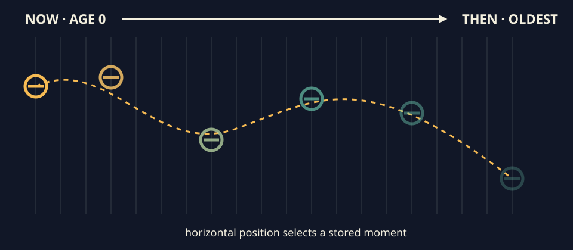

# Time as a drawable axis

This section turns a limited history into something you can place across the
screen: learn the ring-buffer model, practice tracing and viewing it, then make
one tested spatial-temporal collage.

1. [Lesson: turn saved moments into positions](#lesson)
2. [Practice: trace, run, and repair a history](#practice)
3. [Exercise: create a tested temporal collage](#exercise)

## Lesson

### A recent history can become geometry



*A limited history turns horizontal position into ages from the newest through the oldest saved sample.*

The labels, slice boundaries, outlines, and ticks keep age order legible without
relying on color or opacity alone. Use the course's
[credited precedent notes](../../../docs/source-notes.md#visual-vocabulary)
to study time as stored material, not to copy an echo or slit-scan image. Change
the source, lookup, decay, geometry, palette, and interaction.

A **ring buffer** is a fixed row of storage slots used in a loop. When writing
reaches the last slot, it wraps to the first and replaces the oldest value. It
keeps useful recent history without growing forever.

### A ring keeps a bounded amount of time

A [`std::vector<Sample>`](https://en.cppreference.com/w/cpp/container/vector.html)
is allocated once. `next` names the slot overwritten by the next capture, while
`count` never exceeds capacity:

```cpp
storage[next] = sample;
next = (next + 1) % storage.size();
count = std::min(count + 1, storage.size());
```

Age zero always means newest. With capacity 3, push frames 10, 11, 12, then 13:

```text
age 0 -> frame 13 (newest)
age 1 -> frame 12
age 2 -> frame 11 (oldest)
```

Frame 13 wrapped to the first physical slot and replaced frame 10. The read
helper translates age back to a slot:

```text
slot = (next slot + capacity - 1 - age) modulo capacity
```

**Modulo** means wrap after reaching the end. Drawing code can ask for an age
without knowing which physical slot holds it.

The model rejects zero capacity, more than 65,536 samples, multiplication
overflow, or a budget above 8 MiB before allocating. It checks
`capacity * sizeof(Sample)` on the current compiler. Frame numbers must strictly
increase; time cannot go backward; model, decay, and viewport values must be
finite. Rejected pushes and resizes leave the existing history unchanged.

### Position chooses a discrete age

With five samples, positions `0`, `0.24`, `0.5`, `0.76`, and `1` choose ages
`0`, `1`, `2`, `3`, and `4`:

```text
age = floor(position × (history length - 1) + 0.5)
```

Adding `0.5` and dropping the decimal part implements explicit half-up rounding:

```text
NOW                                              THEN
x=0        .24        .50        .76        1.0
age 0  ---- 1  ------- 2  ------- 3  ------- 4
newest                                         oldest
```

This is selection, not interpolation between moments. If you later interpolate,
keep both neighboring ages and the blend amount testable.

### Age can control a stable echo

The reference derives opacity with
[`std::exp`](https://en.cppreference.com/w/cpp/numeric/math/exp.html):

```text
opacity(age) = exp(-decay_rate * age / max(1, n - 1))
```

At decay rate 2, opacity is 1 for the newest sample, about 0.368 halfway, and
about 0.135 for the oldest. The curve stays positive and decreases with age.
It attenuates saved marks instead of feeding bright output back into itself.

`makeMotionSample(frame, time_seconds, width, height, output)` receives explicit
clock values and never reads an openFrameworks clock. Replaying the same tuples
therefore produces the same model sequence under the tested C++17 build. Shrink
keeps the newest suffix; grow preserves chronological order; reset clears the
history without inventing timestamps.

The delivered adapters draw directly. An optional
[`ofFbo`](https://openframeworks.cc/documentation/gl/ofFbo/)
experiment remains behind the renderer boundary because GPU allocation,
orientation, blending, resize, and ping-pong read/write separation need a native
manual check. Pure tests do not create a GL context or compare driver pixels.

## Practice

Practice is guided and has no unit-test gate. Trace a tiny ring by hand, inspect
a working app, then repair one visible ordering mistake.

### 1. Trace wrap, selection, and resize

Open `exercises/13-time-as-a-drawable-axis/fixtures/temporal-oracle.txt` without
running the test suite. Confirm that the origin is `(84, 50)` in a 100-square
viewport and trace its five pinned selections.

On paper, draw three slots. Push frames 1 through 5 and label `next` after each
push. Read ages 0, 1, and 2: they should be frames 5, 4, and 3. Then imagine six
frames in a larger history being resized to capacity 3; the retained suffix is
4, 5, 6 from oldest to newest.

### 2. Build and explore the working solution

Set `OF_ROOT` to openFrameworks 0.12.1. Linux or macOS:

```sh
scripts/section-13.sh generate --project solution
scripts/section-13.sh build --project solution --configuration Release
```

Launch `exercises/13-time-as-a-drawable-axis/solution/bin/solution` on Linux or
the generated app bundle on macOS. Windows Developer PowerShell:

```powershell
.\scripts\section-13.ps1 generate -Project solution
.\scripts\section-13.ps1 build -Project solution -Configuration Release
& .\exercises\13-time-as-a-drawable-axis\solution\bin\solution.exe
```

Press P to pause, R to reset explicit frame/time history, and M to freeze
capture for a reduced-motion still. Resize narrow, wide, and tiny. Watch the
history fill, wrap, and restart against the new viewport.

### 3. Repair an off-by-one history read

In `exercises/13-time-as-a-drawable-axis/shared/temporal_history.cpp`,
temporarily remove `- 1` from the `atAge` slot expression. Rebuild the solution
without regenerating. Compare age zero before and after the first wrap: the bug
reads the next-write slot instead of the newest written sample and can expose an
unwritten slot while the ring is still filling.

Restore the subtraction and rebuild. If that was your only edit:

```sh
git restore -- exercises/13-time-as-a-drawable-axis/shared/temporal_history.cpp
```

That command discards every uncommitted change in the named file.

## Exercise

### Problem: make a spatial-temporal collage

Make spatial position choose age from a bounded, repeatable history. Choose
parameters in `starter/src/design/temporal_design.cpp`, then create your own
geometry grammar in `starter/src/ofApp.cpp`. Keep explicit frame/time input,
finite guards, monotone order, checked memory arithmetic, reset/resize behavior,
keyboard access, and reduced motion.

Use the
[Exercise 13 brief, starter, fixtures, tests, and solution](../../../exercises/13-time-as-a-drawable-axis/README.md)
as the authoritative specification. Your result must differ from the starter's
filled windows and the solution's line-and-diamond loom in more than palette.

### Run the unit tests

Linux or macOS:

```sh
CXX=g++ tests/run-section-13-tests.sh
CXX=clang++ tests/run-section-13-tests.sh
```

Windows Developer PowerShell:

```powershell
.\tests\run-section-13-tests.ps1
```

The suite checks known spatial selections, wrap order, newest-suffix resize,
reset, replay, finite values, monotone frame/time, counter overflow, byte-budget
arithmetic, transactional rejection, and bounded history. With `OF_ROOT`, also
generate and build starter and solution in Debug and Release, then launch your
starter. Automated tests do not inspect GPU pixels.

You may select age with y, distance, or a circular arrangement, interpolate
adjacent samples, or retain several independently bounded histories. An FBO
extension must keep separate read/write targets and receive native allocation,
orientation, clear/alpha, resize, and GPU-limit checks.

### Quick visual check

- Newest-to-oldest order is legible through labels, boundaries, shape, or ticks,
  not color alone.
- P pauses, R repeats from frame/time zero, and M provides a still alternative.
- Tiny windows, resize, fill, and wrap fail safely without flashing or unwritten
  samples.
- Text and marks retain useful contrast and require no audio.
- Spatial grammar, density, temporal range, geometry, and palette differ from
  both supplied examples.
- Capture alt text names the age direction, newest/oldest states, geometry,
  fading, and controls.
- Any FBO path has been checked on the graphics setup you use.
- Reused references, code, and assets are credited.

### If you get stuck

Draw each physical slot and label its current age through one write/read cycle.
Check capacity versus count, then identify which end is newest. A ring buffer is
a queue wearing a circle costume; debug the three-slot version before the
shader-sized one.
