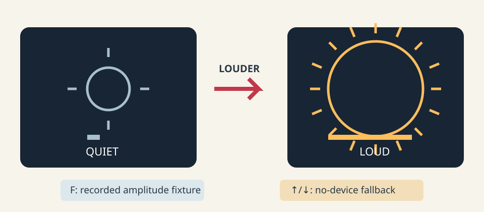

# Embodied audio input

This elective takes one lane only: microphone **amplitude**. It does not survey
3D, spectra, or cameras.

## See what we're making



*Louder input visibly makes one mark larger and denser; recorded and keyboard routes keep the mapping available without a microphone.*

Within five seconds the rule should read: **louder → bigger + more marks**. Size,
count, a written meter, and an ACTIVE/QUIET label duplicate the cue, so neither
hearing nor color is required.

## Borrow the idea, not the artwork

Use the course's [credited precedent notes](../../../docs/source-notes.md#visual-vocabulary)
to study immediate embodied-input feedback while preserving every named
collaborator and performer credit. Transfer only the legible cause-and-effect
loop; change the input context, visual grammar, mapping, interaction, motion,
and staging, and do not copy a precedent's vocal gesture or silhouette.

## Take a guess

The smoothed value starts at 0. With smoothing `alpha = 0.5`, inputs are `0.0`,
`0.05`, then `0.4`. The dead zone is 0.1. Predict each smoothed value, which
steps remain quiet, and the normalized level after the third step. If radius
maps from 20 to 120 and ray count maps from 4 to 24, predict the third radius
and ray count before opening the fixture.

## Let's unpack it

### One input adapter, three explicit sources

The section's one substantial C++ mechanism is an input adapter. All sources
produce one normalized amplitude number:

```text
recorded amplitude fixture ─┐
live microphone RMS ────────┼─> consumeAmplitude ─> state + geometry
keyboard no-device value ───┘
```

The deterministic core never opens a device, reads a clock, draws a pixel, or
stores waveform samples. `InputSource` says `recorded`, `live_microphone`, or
`no_device`; the source state is inspectable rather than inferred from a blank
screen. The fixture contains six synthetic scalar values—not captured sound,
speech, waveform, device identity, or timestamps. The optional openFrameworks
adapter follows the portable [`ofSoundStream`](https://openframeworks.cc/documentation/sound/ofSoundStream/)
callback boundary. Its callback reads frame/channel samples through
[`ofSoundBuffer`](https://openframeworks.cc/documentation/sound/ofSoundBuffer/),
computes one RMS amplitude over at most 4,096 frames, publishes that scalar,
and retains no audio.

The program begins in no-device mode. Pressing L is the only action that asks to
open the system's selected default input. Before doing so, tell people nearby,
obtain consent, select the intended input in operating-system sound settings,
and verify the on-screen `LIVE MICROPHONE` label. Press N or exit to stop and
close it. If setup fails, the adapter returns visibly to keyboard fallback.
These choices follow the W3C's broader [privacy and security considerations](https://www.w3.org/TR/mediacapture-streams/#privacy-and-security-considerations):
make capture intentional and visible, minimize derived information, and stop
when it is no longer needed. Do not use this lesson to record, identify, or
classify people.

### Smooth first, then remove the floor

Raw amplitude jitters. Exponential smoothing blends the previous result `s`
with new amplitude `x`:

```text
s_new = s_old + alpha * (x - s_old)
```

Visually, `alpha` is how far a marker travels from old to new on each sample:

```text
old 0.0 |--------- target 0.4
alpha .5 moves halfway: 0.2
```

Numerically, the Predict sequence yields `0.0`, `0.025`, then `0.2125`.
Symbolically, the third step is
`0.025 + 0.5 * (0.4 - 0.025) = 0.2125`.

A dead zone suppresses a room/noise floor after smoothing:

```text
level = 0                              when smoothed <= dead_zone
level = (smoothed - dead_zone) /
        (1 - dead_zone)                otherwise
```

With dead zone 0.1, the first two steps are quiet. The third normalized level is
`(0.2125 - 0.1) / 0.9 = 0.125`. The boundary at exactly 0.1 is quiet. Smoothing
comes first so the threshold acts on the same stable state that geometry sees.

### One level becomes inspectable geometry

The core maps normalized level `u` into radius and repeated-mark count:

```text
radius = minimum_radius + u * (maximum_radius - minimum_radius)
rays = round(minimum_rays + u * (maximum_rays - minimum_rays))
active = u > 0
```

For `u = 0.125`, radius is `32.5` and ray count is 7 only if ordinary rounding
is used on 6.5; this implementation computes `floor(value + 0.5)`, so the
answer is **7**. The supplied starter fixture instead pins the actual
floating-point path and checks every row; inspect it when your hand arithmetic
and machine result disagree. Radius, count, normalized level, activity, source,
and accepted/rejected/dropped counters are available before rendering.

Work cannot grow with sound duration. A batch consumes at most 256 amplitudes,
a fixture has at most 4,096 values, one callback inspects at most 4,096 frames,
and geometry has at most 128 repeated marks. The core owns no history or audio
buffer. Invalid negative/NaN amplitudes reject transactionally; values above 1
clamp to 1. Oversize fixture replay rejects without replacing prior state.

## Make it run: inspect three complete experiments

### 1. Replay the scalar fixture

Linux x86-64 or macOS arm64:

```sh
cat exercises/15-embodied-audio-input/fixtures/amplitude-replay.txt
CXX=g++ tests/run-section-15-tests.sh
```

Windows Visual Studio 2022 x64 Developer PowerShell:

```powershell
Get-Content .\exercises\15-embodied-audio-input\fixtures\amplitude-replay.txt
.\tests\run-section-15-tests.ps1
```

The test parses all seven columns, checks each intermediate state, replays the
same amplitudes, and compares final state/geometry. No microphone is involved.

### 2. Use the no-device instrument

Generate and build with openFrameworks 0.12.1, then launch manually. Supported
native wrapper lanes are Linux x86-64, macOS arm64, and Windows Visual Studio
2022 x64 Developer PowerShell. Other architectures are unattested and
unsupported by these wrappers.

```sh
scripts/section-15.sh generate --project starter
scripts/section-15.sh build --project starter --configuration Release
exercises/15-embodied-audio-input/starter/bin/starter
```

On macOS, launch the generated app instead:

```sh
open exercises/15-embodied-audio-input/starter/bin/starter.app
```

On Windows:

```powershell
.\scripts\section-15.ps1 generate -Project starter
.\scripts\section-15.ps1 build -Project starter -Configuration Release
& .\exercises\15-embodied-audio-input\starter\bin\starter.exe
```

Press Up/Down. Confirm the circle and meter grow together and the source label
says `NO DEVICE`. Press F to replay. P pauses, R restarts the current source, and
M reduces repeated marks. These routes make the complete instrument usable
without capture permission or hardware.

### 3. Optionally try live amplitude

Only after consent and selecting the intended OS default input, press L. A
successful setup labels itself `LIVE MICROPHONE`; louder input should enlarge
the same geometry. N closes the stream and restores keyboard control. On macOS,
the section wrapper adds the required microphone-purpose string to generated
application metadata; the app still opens no device until L. If L returns to
`NO DEVICE`, use N/F/Up/Down and diagnose permissions or device selection
outside the sketch. Unit tests and compilation do not prove that an
actual device opened, that OS permission UI appeared, or that the graphics
launched.

## Break it on purpose

In `exercises/15-embodied-audio-input/shared/audio_input_model.cpp`, temporarily
change the final activity expression from `normalized > 0.0f` to
`smoothed >= design.dead_zone`. Run the section tests. The exact-boundary case
uses smoothing 1 and an input equal to the dead zone: its geometry must remain
quiet, so the planted `>=` makes the test fail even though normalized level is
still zero. Restore `normalized > 0.0f`, rerun, and record the failure and
repair. To discard
only that file's uncommitted changes:

```sh
git restore -- exercises/15-embodied-audio-input/shared/audio_input_model.cpp
```

## Your turn

Open the [five-second audio instrument brief](../../../exercises/15-embodied-audio-input/README.md).
Keep the tested input adapter, but own response parameters in
`starter/src/design/audio_instrument_design.cpp` and the visual grammar in
`starter/src/ofApp.cpp`. Create a composition unlike both examples while
preserving an immediately inferable mapping, visible source/activity, keyboard
fallback, fixture replay, bounded work, pause/reduced routes, and no retention.

## Check your work

```sh
CXX=g++ tests/run-section-15-tests.sh
CXX=clang++ tests/run-section-15-tests.sh
scripts/check-authoring.sh
```

Run the PowerShell suite on Windows. With a proven openFrameworks installation,
generate and compile starter and solution in Debug and Release. Then manually
launch no-device and fixture routes. Live microphone behavior is optional and
manual; never convert its absence into a failed creative exercise.

Known cases pin all fixture rows. Boundary cases cover exact quiet output,
clamping, invalid values, invalid designs, work caps, and oversize fixtures.
Property checks prove steady loud input cannot shrink radius and all geometry
stays bounded. Wrapper probes reject incomplete `OF_ROOT` before cleanup.
Screenshots, device behavior, consent, and five-second legibility remain manual.

## Tell the story

In 160–200 words, explain the adapter boundary, smoothing order, dead-zone
boundary, scalar-to-radius/count mapping, fixture determinism, callback work
cap, no-retention rule, selected-device/consent choice, explicit fallback, and
one non-color/non-audio cue. State what automated tests proved and what you
observed manually. Include capture alt text that names the source label, quiet
and loud shapes, meter length, density, and palette roles.

## Make it yours

Try a wider horizon, stacked glyphs, line weight, spacing, or symmetry instead
of a sun. Keep loudness monotonic in at least one obvious dimension. You may map
silence to stillness, but retain the activity label and meter. Do not add
spectrum analysis, recording, classification, camera input, unbounded history,
or a second elective lane.

## Quick visual check

- A new viewer can state the input-to-output rule within five seconds.
- F and Up/Down operate without a device; N visibly identifies fallback.
- L is opt-in; the selected default device and consent were checked first; N/exit stops it.
- No waveform, sound, identity, timestamp, or device metadata is saved or logged.
- Size/count, meter, text, and shape provide cues independent of sound and color.
- P pauses; R replays; M reduces repeated marks; nothing flashes.
- Below 680×360, high-contrast resize/source/stop guidance replaces the composition. The adapter uses openFrameworks 0.12.1's fixed 8-pixel bitmap-glyph metric, preserves distinct recorded/live/no-device labels while they fit, and progressively shortens each to the essential `N` fallback key. A viewport too small for one glyph is not usable, but model work remains bounded.
- Geometry, composition, response, and palette differ materially from both examples.
- Capture alt text and reused code/assets are credited.

## If you get stuck

Start with the recorded input. It gives you a repeatable signal while you
untangle smoothing and mapping. Then try the no-device route before debugging
permissions. Live audio is optional; the sketch should still be fun when the
microphone is unplugged, shy, or being used by a video call.
