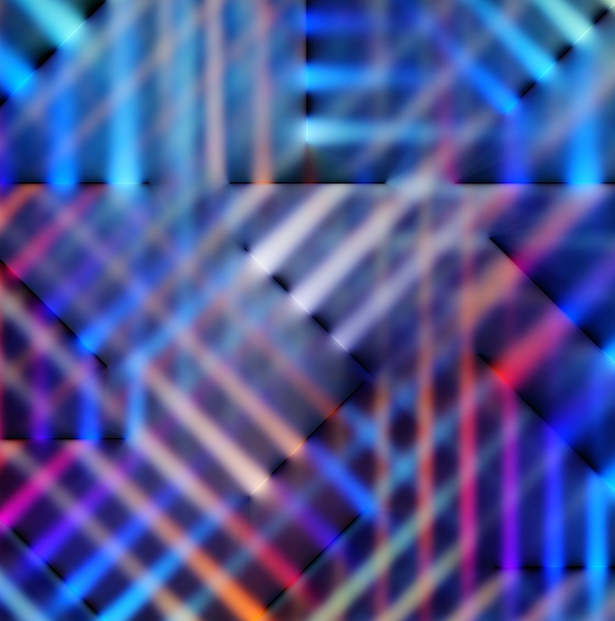

# Structured chance and spatial grammar

The first randomness lesson made repeatable editions. This lesson asks a harder
question: how can chance make a composition feel surprising **and** authored?
The answer is not “add more random numbers.” It is to make choices at different
scales, let small choices inherit from large ones, and decide where chance is not
allowed to draw.

1. [Lesson: make random choices related](#lesson)
2. [Practice: compare chaos with family resemblance](#practice)
3. [Exercise: build a luminous panel grammar](#exercise)

## Lesson

### Read the structure before the decoration



*Course-owner-supplied reference attributed to Zach Lieberman. We use it to ask questions about hierarchy, related variation, panel boundaries, density, and light rather than to infer the original implementation.*


*The original course diagram turns those observations into a teachable three-level grammar. The empty space is generated deliberately, not left to luck.*

A useful generative sketch often has a **grammar**: a small set of relationships
that every seed must respect. Looking at a finished image cannot reveal the
artist's exact code, so we will not pretend to reverse-engineer one. We can still
identify transferable visual questions: Where are the large divisions? Which
marks seem related? Where does the composition become dense? Where does it stop?

The source for this exercise has three levels:

```text
composition: shared grid, dominant angle, two-color family, one quiet region
region:      warped panel, inherited angle, density band, palette role
mark:        clipped line, small offset, width variation
```

If every line independently chooses x, y, angle, width, and color, the result
usually reads as noise. Here a line inherits most of its identity from its
region, and each region inherits from the composition. Chance changes a
relationship without erasing it.

### Correlation means sharing a cause

Suppose the composition angle is `0.8` radians and the allowed regional change
is `0.24`. A region may draw a small change such as `-0.10`:

```text
region angle = composition angle + family shift + small random change
             = 0.80              - 0.12        - 0.10
             = 0.58 radians
```

Every stroke in that region uses `0.58`. The strokes differ in spacing and
width, but they still look like one family. **Correlation** here simply means
“these values share a cause.” No statistics course is hiding behind the door.

Use the same pattern for color, scale, speed, or curvature:

```cpp
const float region_angle = composition_angle + bounded_jitter;
const int mark_color_role = region_color_role;
```

The important move is deciding which value belongs to which level. Randomness
chooses within a range you designed; it does not design the hierarchy for you.

### One node lattice prevents accidental cracks

The model first generates one `(rows + 1) × (columns + 1)` lattice. Adjacent
panels point to the same nodes. For a 3 × 3 panel arrangement, that means 16
nodes rather than 36 unrelated corners.

An interior node may move a small amount. Boundary nodes stay on the frame. The
model then rejects invalid settings and any panel that folds over itself. This
shared ownership matters visually: two almost-equal seam positions produce a
bright crack or overlap once wide translucent lines are layered.

### Clip in a square, then warp the answer

Each region begins as a local square from `(0, 0)` to `(1, 1)`. An infinite line
through that square is trimmed to the first and last boundary it crosses. Its two
local endpoints are then mapped into the panel with bilinear interpolation:

```text
top    = lerp(top_left,    top_right,    local_x)
bottom = lerp(bottom_left, bottom_right, local_x)
point  = lerp(top,         bottom,       local_y)
```

At local `(0, 0)` the answer is the panel's top-left corner. At `(1, 1)` it is
the bottom-right. At `(0.5, 0.5)` it is the panel center. Because clipping happens
in the simple square first, line generation does not need special cases for each
warped panel.

### Glow can be a stack, not a filter

The starter draws the same segment three times: a wide faint line, a medium
faint line, and a narrow bright core. Additive blending lets overlapping light
accumulate. The official
[blend-mode reference](https://openframeworks.cc/documentation/graphics/ofGraphics/#show_ofEnableBlendMode)
explains the renderer state used here.

This is not physically correct blur, and it does not claim to reproduce a
particular artwork. It is a portable way to study luminous hierarchy before
adding a custom shader. Section 13's
[`ofFbo` technique](https://openframeworks.cc/documentation/gl/ofFbo/)
remains available if you later want an offscreen feedback or post-processing
experiment.

Draw dark seams **after** the light layers. The seam is part of the composition,
not an apology for imprecise clipping.

### Quiet space is a parameter

One region receives `quiet_strokes` instead of the active density range. That is
a constraint, just like a maximum count or a legal viewport. A generated empty
area is more reliable than hoping a random sample happens to leave breathing
room.

When reviewing seeds, keep the grammar fixed and ask why one result works better:
large-scale balance, direction, density, and voids are more useful answers than
“this seed got lucky.” Zach Lieberman's public
[`dailySketches` repository](https://github.com/ofZach/dailySketches)
shows the value of sustained iteration; use that as permission to make many
small authored studies, not as a source of target compositions to copy.

## Practice

Practice the hierarchy before running the section tests.

### 1. Sort choices by scale

Put each choice in one row of a three-row table: dominant angle, panel corner,
region density, individual line width, palette family, one quiet region, and
line-spacing jitter. More than one organization can work, but every mark-level
choice should have a reason not to belong to its parent.

Then predict the visual difference between these two rules:

```text
A: every stroke draws an angle from 0 to 2*pi
B: composition chooses 0.8; regions vary by at most 0.24; strokes inherit region
```

### 2. Build and inspect the solution

Linux or macOS:

```sh
scripts/section-16.sh generate --project solution
scripts/section-16.sh build --project solution --configuration Release
```

Windows Developer PowerShell:

```powershell
.\scripts\section-16.ps1 generate -Project solution
.\scripts\section-16.ps1 build -Project solution -Configuration Release
```

Press `R` and confirm the same seed returns. Press `N` several times and look for
what stays related. Press `G` to remove the wide translucent layers. Notice that
the geometry survives even when the glow disappears.

### 3. Repair independent angles

In `exercises/16-structured-chance/shared/structured_chance_model.cpp`, temporarily
move the angle draw into the stroke loop and give every stroke a full-circle
range. Rebuild and compare. The panels remain but their local family resemblance
collapses.

Restore the file before continuing:

```sh
git restore -- exercises/16-structured-chance/shared/structured_chance_model.cpp
```

That command discards every uncommitted change in the named file.

## Exercise

### Problem: compose a constrained luminous family

Create a seeded panel composition whose visible relationships survive at least
20 seeds. Keep one shared node lattice, bounded panel warping, inherited regional
angles, one deliberate quiet region, clipped local lines, density caps, `R`/`N`/`G`
controls, and a non-glow view. Change the grid proportions, angle hierarchy,
density rhythm, line grammar, seams, and palette so your result differs in
structure—not only color—from both examples.

Use the
[section 16 exercise brief](../../../exercises/16-structured-chance/README.md)
as the authority for editable files and constraints. Start in
`starter/src/design/structured_chance_design.cpp`, then change drawing in
`starter/src/ofApp.cpp`.

### Run the tests

Linux or macOS:

```sh
CXX=g++ tests/run-section-16-tests.sh
CXX=clang++ tests/run-section-16-tests.sh
```

Windows Developer PowerShell:

```powershell
.\tests\run-section-16-tests.ps1
```

The tests check seed replay, exact shared seams, positive panel area, bounded
warping and angle inheritance, finite clipped segments, one quiet region, and
work caps. They do not grade palette, glow, or composition.

### Quick visual check

- Twenty seeds still look like members of one family rather than unrelated demos.
- At least one region stays quiet and no seed fills every available space.
- Panel seams remain dark and continuous at narrow, square, and wide windows.
- `G` leaves a readable non-glow structure; color is not the only family cue.
- Nothing flashes, and `R`, `N`, `G`, and `H` are available from the keyboard.
- Your layout, density rhythm, marks, and palette differ from the examples and any cited influence.

### If you get stuck

First print one composition angle and two regional angles. If they are unrelated,
fix the inheritance before touching color. For seam cracks, print the two node
indices used by neighboring panels; they should refer to the same lattice values.
For missing lines, test one local center line through `(0.5, 0.5)` before adding
jitter.
