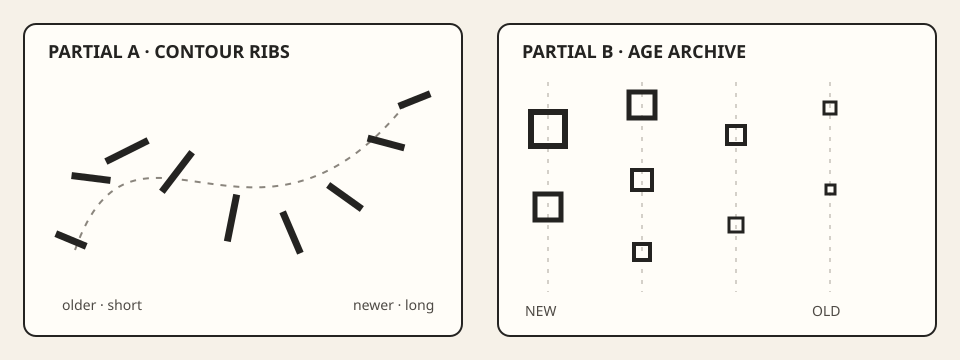
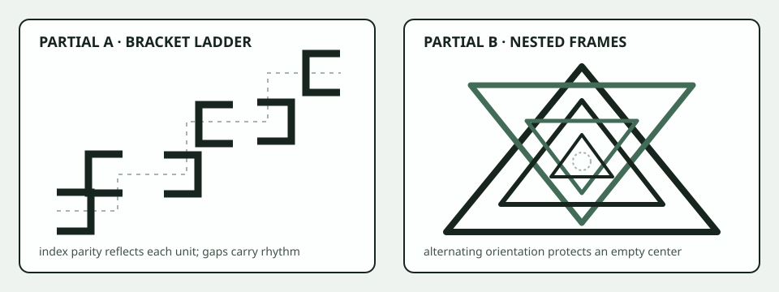
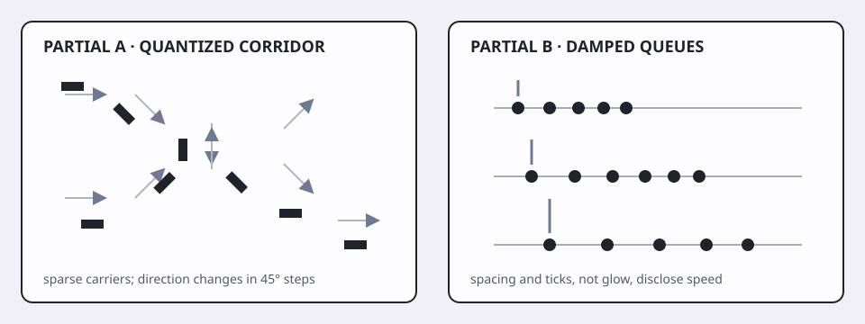

# Three cumulative sketch studies

## The mission

Make **three small, separate sketches**, not one app with three modes. Each one combines
two techniques you have already used. You still choose the layout, colors, marks, and
controls.

Treat these as quick practice sketches. Try to finish each in one focused sitting so
the ideas do not grow into month-long projects. The limits below are
scope helpers; stopping with a working sketch is more useful than racing a timer.

| Study | Techniques to combine | Keep the scope this small | Helpful things to save |
|---|---|---|---|
| A | gesture + memory | one pointer; at most 96 saved points; no particles | one small test, one image, a short note |
| B | repetition + oscillation or transforms | one repeated unit; 8–64 copies; at most two moving values | one small test, one image, a short note |
| C | particles + forces or flow | at most 256 particles; one force or one flow field; fixed time step | one small test, one image, a short note |

When a sketch works, resist adding another system. Keep reset working and write down
anything unfinished. You can return later if the idea still interests you.

For each sketch, keep one important calculation outside `ofApp` so a test can run
it without opening a window. Give the test explicit values for its seed, recorded input,
window size, time step, and rounding allowance. The saved input and expected
answer are called a **fixture** in the provided filenames.

The optional [small-test notes](templates/model-test-contract.md) can help before coding,
and the [picture-and-note page](templates/capture-and-explanation.md) can help afterward.
Use only the parts that help you think. The saved rows are examples for your tests;
they are not code you need to copy.

## Reuse three working starters

Do not create a brand-new project layout for these studies. On your course branch, reuse
three **different existing starter directories**. That keeps the build and test commands
you already know:

| Study | Supported bases | Baseline wrapper |
|---|---|---|
| A | section 08 gesture starter | `section-08` |
| B | section 05 oscillation or section 07 transform starter | `section-05` or `section-07` |
| C | section 10 force or section 11 flow starter | `section-10` or `section-11` |

For each selected `NN`, run from the repository root:

```sh
NN=08  # replace with the base chosen from the table
CXX=g++ "tests/run-section-${NN}-tests.sh"
"scripts/section-${NN}.sh" generate --project starter
"scripts/section-${NN}.sh" build --project starter --configuration Release
```

On Windows Developer PowerShell:

```powershell
$NN = "08" # replace with the base chosen from the table
& ".\tests\run-section-$NN-tests.ps1"
& ".\scripts\section-$NN.ps1" generate -Project starter
& ".\scripts\section-$NN.ps1" build -Project starter -Configuration Release
```

Launch the generated starter by the platform pattern in that exercise README and confirm
reset works. That working baseline is enough to begin. If you already use Git,
an optional commit or tag can make experiments easier to undo. Preserve the base's public declarations and extend its existing
`shared/*.h` and `shared/*.cpp` model pair with the study's pure operation; the
fixed-inventory project wrappers reject additional source files by design. Add the study
fixture under the existing exercise's `fixtures/` directory and extend the existing
`tests/*.cpp` checks (and both fixed-file-list runners if the fixture needs a new
argument) so the same section runner executes inherited and study-specific checks.
The optional model-test template can hold the chosen paths and commands if that would be
useful later.

This is a build/test bootstrap, not a visual starting point. Remove or replace the base
composition rather than presenting the earlier exercise as one layer of the study. The
three different starter directories remain three separate native sketches, and Git
preserves the pre-synthesis solutions if recovery is needed.

## A useful stopping point

You can move on when:

- its two chosen techniques affect the same visual rule instead of sitting in
  unrelated layers;
- reset returns to the documented beginning and replaying the saved input gives the same
  answer;
- its small test runs without a graphics window, clock, pointer, audio device, or
  network;
- you check one ordinary case, one edge case, and one rule that should always remain
  true; and
- borrowed code, artwork, type, images, audio, and add-ons are credited and licensed.

A saved image or note is optional. If you keep or share an image, give it descriptive
alt text and use more than color alone to communicate the idea.

The supplied TSV test rows were made for this course and dedicated under CC0-1.0. Their
[licensing and error-handling notes](fixtures/README.md) explain how they may be reused.

The Web Content Accessibility Guidelines' guidance for [non-text content](https://www.w3.org/TR/WCAG22/#non-text-content) is the minimum,
not the entire review: use alt text to explain the visual rule, current state, and
meaningful change shown in the image.

## Study A — Gesture remembered as structure

### Rules and choices

Accept one pointer stream, retain no more than 96 samples, and make age or history
position change geometry. Temporal memory must do more than leave an alpha trail. It
might reorder, offset, connect, fold, stamp, or erode sampled points. You choose the
sampling rule and visual approach.

### Small calculation to test

Implement a pure acceptance-and-memory operation. Given previous accepted points, a
candidate point, a minimum distance, and a capacity, it returns a new limited sequence.
Distance exactly equal to the threshold is accepted; a nearer point is rejected without
changing state; overflow evicts the oldest point. Run the sequential cases in
[`gesture-memory.tsv`](fixtures/gesture-memory.tsv). Compare coordinates with a documented absolute tolerance no larger than
`0.0001`.

Keep three small checks:

- `(3, 4)` is accepted after `(0, 0)` when the minimum distance is 5;
- a point exactly 5 units away is accepted; and
- the list never grows past its limit, while a rejected point leaves it unchanged.

### Optional: save one result

If this study is worth remembering or sharing, capture one gesture after enough input
to reveal memory order. Give the image alt text that names the newest and oldest visible
structures, the non-color cue for age, and the interaction state. An optional short note
can explain the retention rule, visual age mapping, one composition choice, and one
limitation.

### Two unfinished directions



*Two unfinished directions: contour ribs preserve adjacency, while age columns deliberately break the original path.*

- **Contour ribs:** resample by distance, estimate a tangent, and draw short normal
  segments whose spacing indicates age. It remains incomplete: no palette or interaction
  beyond reset.
- **Age archive:** assign accepted points to four age bands and stamp only relative turn
  direction. It remains incomplete: the final composition and motion rule are undecided.

These approaches differ from a worked calligraphic polyline: one turns the gesture into
a measured cross-section; the other discards literal path continuity.

## Study B — Repetition under a local rule

### Rules and choices

Use one repeated unit 8–64 times. Combine repetition with **either** oscillation or
local transforms. Animate no more than two model parameters. Each instance must be
derivable from its index and explicit model inputs; avoid hand-placing exceptions to
repair the composition.

### Small calculation to test

Choose the small calculation that matches your second technique.

**Transform route:** implement `transformPoint(local, translation, angleDegrees)` independently of the renderer. Rotation
occurs around local origin before translation. Run the known angles in [`repetition-transform.tsv`](fixtures/repetition-transform.tsv)
with absolute tolerance `0.0001`. Check that `(10, 0)` at zero degrees
preserves its offset, that 360 degrees agrees with zero, and that rotation preserves
distance from the translated origin.

**Oscillation route:** implement `oscillationOffset(phaseRadians, amplitude)` as `amplitude * sin(phaseRadians)`. Run [`repetition-oscillation.tsv`](fixtures/repetition-oscillation.tsv)
with absolute tolerance `0.0001`. Check zero phase, the positive and negative
quarter-cycle extrema, one full-cycle return, and the rule that the absolute offset
never exceeds the absolute amplitude.

Use the saved test rows that match your route: transform rows for transforms, or
oscillation rows for oscillation.

### Optional: save one result

If this study is worth remembering or sharing, capture a frame that shows both the
repeated index and the local rule. Give the image alt text that states the repeated unit,
count or density, ordering cue, and whether time is paused. An optional short note can
connect index to placement, explain transform order or phase, and name one embellishment
you chose not to add.

### Two unfinished directions



*Two unfinished directions: a discontinuous bracket ladder and nested alternating frames avoid the radial sine-field approach of worked examples.*

- **Bracket ladder:** translate one open bracket along a piecewise staircase; use index
  parity for reflection and no sine wave. The gap, not the mark, carries rhythm.
- **Nested frames:** scale and rotate one triangular outline around an empty center;
  pause time and let transform order create interference. It has no settled interaction
  or palette.

Try to make at least one study this different from the worked examples: not a radial
grid or a field of circles whose size follows sine. In your note, mention the familiar
approach you skipped and what you tried instead.

## Study C — A limited population in one influence

### Rules and choices

Use at most 256 particles and choose **one** influence family: accumulated forces or a
sampled flow field. Every particle shares one explicit fixed step. No trails longer than
eight points, no collision system, and no second force added only for visual complexity.
Spawn from a recorded event or seed.

### Small calculation to test

Implement one semi-implicit Euler step: first `velocity += influence * dt`, then `position += velocity * dt`.
Replay [`particle-step.tsv`](fixtures/particle-step.tsv) sequentially from zero state using `dt = 0.5`. Compare with
absolute tolerance `0.0001`. Production code may substep at a smaller fixed step;
if so, add a fixture generated from that stated step rather than editing expected values
silently.

Keep three small checks:

- constant horizontal influence changes velocity before position;
- zero influence leaves velocity unchanged; and
- ordinary number inputs produce ordinary number outputs, while the population never
  grows past its limit.

### Optional: save one result

If this study is worth remembering or sharing, capture a seeded or replayed checkpoint.
Give the image alt text that names population shape, direction cue, boundary behavior,
and a non-color encoding of motion. An optional short note can connect influence to
update order and fixed steps to replay, then name one limit and one thing you noticed by
looking at the sketch.

### Two unfinished directions



*Two unfinished directions: sparse oriented carriers traverse a blocky corridor; dense dots collect into damped queues.*

- **Quantized corridor:** a coarse, recorded field turns sparse rectangles in 45-degree
  increments; boundary exit respawns from a fixture event. No translucent trail is used.
- **Damped queues:** particles seek one of three horizontal anchors and encode speed
  through spacing, not glow. The partial stops before adding input or a final color
  system.

## Save enough to return to the sketch

Keep the source and build command with each study. If the idea is worth revisiting, add
whichever test rows, image, short note, controls, replay values, and credits will help.

Ask yourself:

- Do the two techniques shape one shared visual rule?
- Does the small test cover an ordinary case, an edge, and an always-true rule?
- Are particle counts, saved history, reset, and time handling clearly limited?
- Does the sketch differ from the worked examples in structure, not only color?
- Could another person understand the result from the image, alt text, and short
  explanation?

A similar-looking still is a reason to compare choices, not an automatic failure. Look
at shape, density, mapping, interaction, motion, and use of time. Write down which
choices are yours.

## Before you leave the studies

Look back over the three sketches and ask:

- Did each pair of techniques produce one shared visual rule?
- Can one small test replay an important calculation in each sketch?
- Did you save an image and a short note that will help you remember the idea?
- Does at least one sketch differ structurally from the worked examples?
- Do reset, limits, time, saved input, and controls behave well enough to return later?
- Did you credit anything you borrowed?

If one answer is “not yet,” either make one small repair or write down where you stopped.
That note is enough. Stop there unless you feel curious enough to continue.
