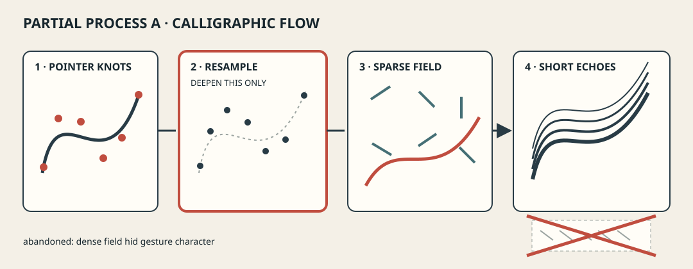
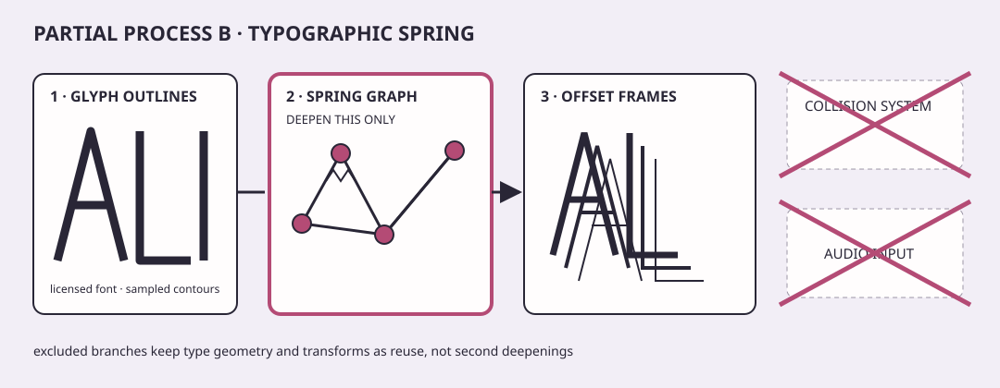
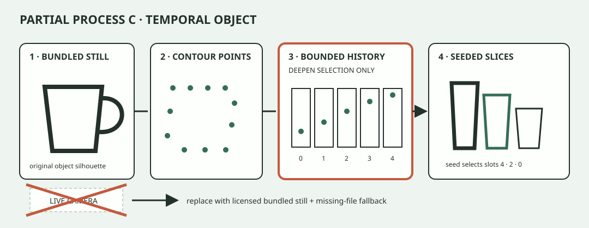
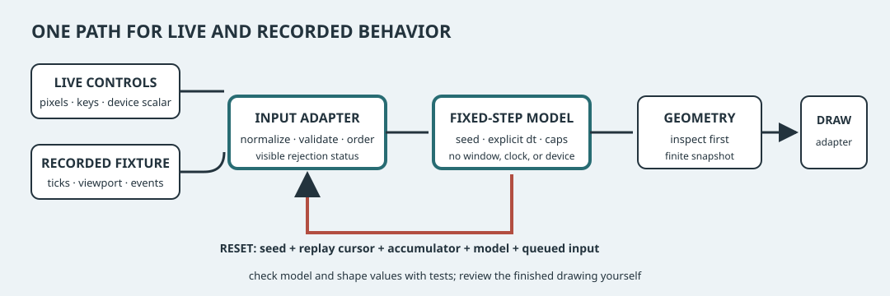

# Original visual-instrument capstone

## The mission

Create one coherent **visual instrument**: a sketch whose controls have legible,
repeatable consequences and whose model can be inspected without rendering. It
may perform live, replay a recording, or do both. It is not a feature survey,
gallery clone, or three unrelated miniatures.

Your capstone must:

1. combine at least three concepts from sections 03–15;
2. declare **exactly one** of those concepts as the area of deeper study;
3. keep its deterministic core replayable where practical;
4. handle resize, reset, missing assets or devices, malformed replay data, and varying frame time;
5. include source, build notes, controls, credits/licenses, captures, and test results; and
6. document mechanism-level originality and accessible alternatives.

“Deepen” means investigate one mechanism beyond its earlier exercise: derive a
new mapping, compare integration policies, design a richer sampling method, or
measure a meaningful performance/quality tradeoff. The other concepts must use
course-level mechanisms you can already explain. Adding a shader, addon, device,
physics engine, or second deep algorithm counts as a second deepening even if it
is visually subtle. Remove it or make it an explicitly deferred experiment.

Start with the [capstone plan](templates/capstone-plan.md). It freezes the three
or more concept roles, the one deepening, exclusions, input vocabulary, replay
schema, budgets, fallback, and evidence before polish begins.

## A little scaffolding

Create a `learner/capstone` branch from the commit that contains all three
section 16 studies. Select the one study whose existing model seam is closest
to the declared deepening and evolve **that one native starter** into the
capstone; do not merge three `ofApp` implementations or generated project
directories. Keep the selected section wrapper as the native generation/build
entry point and preserve its public model/design declarations.

Before milestone 1, rerun the selected section's baseline test, generation,
build, and launch commands from the [section 16 bootstrap](../16-three-sketch-studies/index.md#supported-bootstrap-before-the-timer).
Record the selected section number, starter path, executable path, and clean
commit in `capstone-plan.md`. Extend the selected exercise's existing model
header/source pair with capstone types and operations—the wrapper rejects extra
source files by design—and add project fixtures under its existing `fixtures/`
directory. Extend its existing framework-free test source and both platform
runners when needed so the original section contract and capstone evaluator run
through one checked command. The generated Xcode/Visual Studio/Make metadata remains ignored and
must not be submitted.

This path supplies build plumbing, not capstone content. The completed study is
process evidence; the capstone must still satisfy three-concept coherence,
exactly-one deepening, divergent thumbnail, originality, and publication gates.
If no completed study offers an honest model seam, record that as a curriculum
blocker rather than creating undocumented native metadata.

## No single right answer

The diagrams below are unfinished process slices, not final compositions,
starter layouts, or quality targets. They omit palette resolution, complete
controls, and publication polish on purpose.



*Partial process exemplar A combines gesture, flow, and temporal memory; only gesture resampling is deepened, and a dense-field dead end remains visible.*



*Partial process exemplar B combines type geometry, springs, and transforms; only spring response is deepened, while collision and audio are rejected scope.*



*Partial process exemplar C combines image geometry, bounded temporal memory, and controlled chance; only history selection is deepened, with live camera capture deliberately removed.*

These are genuinely divergent in source material, geometry, density, input,
mapping, and temporal behavior. Borrow their **process moves**—small probe,
recorded rejection, isolated contract—not their layouts. No canonical finished
capstone is supplied.

## Keep the moving parts understandable

Use four explicit boundaries, even if each is only a few functions:

```text
live or recorded events -> input adapter -> deterministic model -> geometry snapshot -> renderer
                                    ^                 |
                                    |---- reset ------|
```

The model receives normalized events, a fixed simulation step, configuration,
and seed. It does not read the wall clock, viewport globals, device, filesystem,
or framework random generator. The renderer receives a geometry snapshot and
may use openFrameworks calls, but cannot silently mutate simulation state.



*Replay contract: normalize once, advance with explicit fixed steps, inspect geometry before rendering, and make reset restore the recorded beginning.*

Use [`replay-events.tsv`](fixtures/replay-events.tsv) to test the universal input
adapter. Then add one project-specific fixture with the same principles and
record it in the evaluator report. Running the same seed, configuration,
viewport events, normalized input order, and fixed steps twice must produce the
same project-defined state/geometry checkpoints within a stated tolerance.
Avoid byte hashes of renderer output and unstable serialization padding.

## Go deeper in one place

Complete this declaration before milestone 2:

| Role | Concept | Existing course mechanism reused | Capstone evidence |
|---|---|---|---|
| Deepened — exactly one row | | | hypothesis, comparison, and result |
| Combined | | | model or geometry checkpoint |
| Combined | | | model or geometry checkpoint |
| Optional combined | | | model or geometry checkpoint |

Below it, list exclusions. A reviewer should be able to strike one feature and
still see the deepening clearly. If two rows require new algorithms,
performance investigations, or unfamiliar APIs, the capstone is out of
contract until one becomes ordinary reuse or is removed.

## A path through the project

### 1. Intent, precedent, and smallest probe

Write a one-sentence experience: **action → visible consequence → expressive
range**. Name at least one visual or technical precedent and the transferable
principle, not just its appearance. Inventory code, fonts, images, audio,
addons, datasets, and capture material with creator, source, license, planned
changes, and redistribution status. Make a 30-minute black-and-white probe of
the deepest uncertainty.

### 2. Deterministic mechanism proof

Implement the input adapter and pure model slice. Run the supplied replay and
frame-time fixtures. Add one project fixture that catches a plausible wrong
implementation of the deepened concept. Record exact commands and failed as
well as passing evidence. No finished rendering is required.

### 3. Three thumbnail systems

Make three low-cost alternatives that vary at least four of geometry, density,
palette, input, mapping, interaction, motion, and temporal behavior. Keep the
same concept set so this is a visual-system comparison rather than feature
shopping. Choose one using stated intent and access constraints; archive the
two rejected thumbnails with reasons.

### 4. Instrument and failure pass

Connect the chosen system to live and fixture input. Add visible states for
paused, replaying, fallback, reduced motion, and unavailable input. Exercise
resize, reset, tiny viewport, missing material, malformed replay, a long frame,
and sustained budget load before final capture.

### 5. Evidence and publication package

Freeze source, build command, controls, test output, capture log, process note,
credits/licenses, known limitations, and project fixture. A new reader must be
able to distinguish automated evidence from manual observation and reproduce a
recorded checkpoint without the original device.

## Tiny tests to keep you honest

Fixture formats and rejection rules are documented in
[`fixtures/README.md`](fixtures/README.md). The supplied TSV fixtures are
original course evaluator data by Visual Sketches Bootcamp contributors,
dedicated under CC0-1.0. The evaluator must run headlessly. Use the
[evaluator report template](templates/evaluator-report.md).

### Replayability

[`replay-events.tsv`](fixtures/replay-events.tsv) pins viewport normalization,
event order, reset seed, and invalid-event rejection. Feed accepted normalized
events to the project model. Test:

- same seed + configuration + accepted events + fixed steps gives equivalent checkpoints twice;
- changing only the seed changes at least one declared stochastic choice while preserving caps;
- reset clears queued/live adapter state and restores seed, model, clock accumulator, and replay cursor; and
- malformed or unknown events reject transactionally with a visible diagnostic.

### Resize

Viewport size is an event, not hidden global state. Define whether model
coordinates are normalized, reflowed, scaled, clamped, or preserved. Test the
recorded `800×600 → 400×200` sequence, then zero/tiny dimensions. Geometry must
remain finite and bounded; controls and status remain available. A resize must
not consume randomness or reset replay unless that policy is explicitly part
of the fixture.

### Reset

A single reset operation restores a documented initial state. Invoke it during
live input, replay, pause, and fallback. The first checkpoint after reset must
match a fresh instance with the same configuration and seed. Renderer caches
may rebuild, but cannot alter the model result.

### Failure behavior

Run every row in
[`failure-cases.tsv`](fixtures/failure-cases.tsv). Replace each abstract
fallback with the project's concrete one and preserve the observable status
code. Failures must not leave stale live-input labels, partially replace valid
state, or crash. Required cases are missing asset, unavailable device when a
device is used, malformed replay, tiny viewport, and non-finite frame time. If
no device or asset is part of the capstone, prove the corresponding adapter is
absent and provide a `NOT_APPLICABLE` evaluator row with reason rather than
pretending the failure was exercised.

### Frame time and budget

Sample frame time only at the application boundary. The framework's
[`ofGetLastFrameTime`](https://openframeworks.cc/documentation/utils/ofUtils/#show_ofGetLastFrameTime)
can supply that sample, but the model accepts explicit seconds. Clamp a pause,
advance a fixed-step accumulator, cap catch-up work, and report dropped time or
steps visibly rather than hiding a spiral of death.

Run [`frame-times.tsv`](fixtures/frame-times.tsv): with fixed step `0.01`, maximum
frame delta `0.05`, and maximum five catch-up steps, partitions A and B both
advance ten steps; the spike case clamps to five. Your production constants may
differ, so add a project-specific fixture and state why its budgets fit the
instrument. Record median and worst observed update/draw milliseconds, viewport,
renderer, build configuration, population/geometry counts, and measurement
method. Performance numbers are observations, not portable pass thresholds;
caps and finite state are automated contracts.

## Make it easy to play

Supply a persistent or toggleable help view that lists every control and status.
At minimum provide reset, pause, replay from beginning, reduced-motion route,
and exit. A pointer gesture needs a keyboard or recorded-input route when
practical; continuous controls need stated ranges and defaults. Focus order and
labels must remain readable against the sketch.

Within five seconds, a new viewer should infer one primary mapping. Confirm it
without audio and without naming colors. Do not use rapid flashes. If motion is
triggered by interaction, provide a disable/reduced alternative consistent with
[WCAG animation from interactions guidance](https://www.w3.org/TR/WCAG22/#animation-from-interactions).

## Make it readable for more people

Provide:

- a representative still with alt text naming structure, state, mapping, and non-color cues;
- a motion transcript ordered by event/time, including controls and meaningful change;
- a paused or reduced-motion capture that communicates the same primary rule;
- control labels, status text, and redundant shape/position/texture cues;
- a keyboard or deterministic replay route for the primary behavior where practical;
- a statement about sound, camera, privacy, consent, captions, and device fallback, including explicit non-use; and
- manual checks at a tiny viewport, at enlarged OS text/interface scale where available, and without color.

Color may support meaning but cannot be its only carrier, following
[WCAG use of color guidance](https://www.w3.org/TR/WCAG22/#use-of-color).
The report must state what remains inaccessible or untested; a checklist is not
a claim of conformance.

Use the [capture log](templates/capture-log.md) and
[process note](templates/process-note.md). Each motion capture needs captions
when it includes speech, a nearby transcript, and a representative still.

## Make it yours

Originality is reviewed at mechanism level, not by vague style claims or image
similarity alone.

1. Name each precedent, creator, source, license, and transferable principle.
2. Identify reused code/assets/addons and the boundary between reuse and authored work.
3. Explain at least **three deliberate changes** across geometry, density, palette, input, mapping, interaction, motion, or temporal behavior.
4. Show two rejected thumbnail systems and why the selected mechanism better serves intent.
5. Compare model/data flow as well as a still. A confusingly similar still is a warning that prompts review, not the whole test.

The reviewer asks whether the changes alter relationships and behavior, not
whether superficial colors differ. Uncredited derivation, incompatible terms,
or an inability to explain the mechanism blocks publication.

## Credit your ingredients

Complete the [credits and licenses template](templates/credits-and-licenses.md)
for code, assets, fonts, addons, data, precedents, and captures. Use a precise
license identifier where possible; the
[SPDX License List](https://spdx.org/licenses/) is a naming reference, not
permission to assume a license. Preserve notices and share source or changes
when the applicable license requires it. “Found online,” “free,” and a search
result are not licenses. Material with unknown or incompatible terms must be
replaced before publication.

State a license for your own source, captures, and process text. Document
collaborator roles and consent. For camera/microphone work, record whether raw
media is retained, who appears or can be heard, and how consent can be revoked.
A fixture and no-device fallback must allow review without capture hardware.

## How to tell if it's working

Score each row from 0–3. All rows must receive evidence; originality, access,
and licensing cannot be rescued by visual polish.

| Dimension | 0 | 1 | 2 | 3 |
|---|---|---|---|---|
| Coherent combination | fewer than three concepts | concepts coexist as layers | concepts share some rules | at least three concepts form one legible causal system |
| Exactly-one deepening | none or multiple | declaration conflicts with work | one area is deeper but comparison is weak | one hypothesis is compared and other concepts remain disciplined reuse |
| Deterministic core | renderer/device dependent | partial replay | repeatable happy path | replay, reset, resize, invalid input, and seed behavior are tested headlessly |
| Time and bounds | unstable/unbounded | caps or `dt` policy missing | fixed step and caps work | partition evidence, spike handling, counters, and measured manual budget are clear |
| Instrument quality | mapping is opaque | primary consequence needs explanation | mapping is discoverable | controls support expressive range without hiding state |
| Creative authorship | uncredited or derivative | superficial changes | three structural changes documented | intent, rejected systems, data flow, and structural changes demonstrate transfer |
| Accessibility | primary behavior unavailable | alternatives incomplete | still, transcript, controls, reduced route present | redundant cues and manual checks reveal and address limitations |
| Licensing and process | unknown terms or missing source | inventory incomplete | credits and licenses complete | redistribution duties, own-work license, build, tests, and limitations are reproducible |

A publishable capstone has no zero, scores at least 2 in every row, and includes
all required artifacts. The rubric evaluates evidence and decisions, not
resemblance to these partial diagrams.

## Save the good bits

Submit these files or equivalent sections:

- completed `capstone-plan.md`;
- source archive/repository identifier and exact supported build/run commands;
- project-specific deterministic fixture and completed `evaluator-report.md`;
- `controls.md` or an equivalent complete controls table;
- representative still, reduced-motion still, motion transcript, and optional captioned recording;
- completed `capture-log.md` with viewport, seed, replay, fixed-step checkpoint, renderer, and alt text;
- completed `process-note.md` with intent, exact-one deepening, three concepts, three thumbnail systems, test/manual evidence, and known limitations; and
- completed `credits-and-licenses.md` plus required license and notice files.

Do not submit secrets, machine-local project paths, unlicensed binaries, raw
camera/microphone material without consent, or generated openFrameworks project
files that encode a local `OF_ROOT`.

## Ship it—or call it done for now

- [ ] One coherent instrument combines three or more earlier concepts.
- [ ] Exactly one concept is identified and evidenced as deeper; exclusions are explicit.
- [ ] Live and replay routes share an adapter; deterministic checkpoints replay twice.
- [ ] Resize, reset, missing asset/device, malformed replay, tiny viewport, and bad frame time are handled or honestly marked not applicable.
- [ ] Fixed-step, clamp, catch-up cap, finite-state checks, model caps, and measured frame observations are documented.
- [ ] Primary mapping is discoverable; controls, statuses, reduced motion, transcript, alt text, and non-color cues are usable.
- [ ] Precedents and reuse are credited; at least three structural changes and two rejected systems support originality review.
- [ ] Code, assets, fonts, addons, data, captures, and own work have compatible recorded licenses.
- [ ] Build notes, controls, fixtures, test output, captures, process note, and known limitations reproduce the evidence.
- [ ] Partial exemplars were treated as process alternatives, not a canonical finished capstone.
