# A visible lesson title

State the one idea and one final problem this section covers.

## Lesson

### See the idea

Describe the visual goal, then replace this complete preview block while
preserving its accessible alternatives.

*Explain the timing or mapping the learner should notice.*

*Explain what the learner should notice without motion.*

[Reduced-motion still](media/preview-still.svg)

[Motion transcript](media/preview-motion-transcript.txt)

Follow the animation convention in the [authoring guide](../../README.md) when
motion is essential. Replace the placeholder source while retaining a prose
citation to the [primary source](https://example.org/source).

### Explain it

Teach one mathematical model visually, numerically, then symbolically. Add at
most one substantial C++ mechanism. Include one small prediction question.

## Practice

Guide two or three small steps that apply the lesson without invoking the
section unit-test runner. Include exact build/run commands and one focused bug to
repair. Tell the reader what output or visible behavior to inspect, not the
answer.

## Exercise

### Problem

Pose one bounded problem. Name the starter's explicit change points, editable
files, fixed public names, repeatable inputs, and edge cases. Link the exercise
brief, tests, fixtures, and explained solution source-file-relatively.

### Run the tests

Give exact Linux, macOS, and Windows commands here. Explain the known case,
boundary, and useful property the deterministic tests check. Keep renderer
appearance in the manual checklist.

### Quick visual check

- The intended input/output relationship is legible.
- Resize, reset, pause/reduced motion, and non-pointer controls work as stated.
- The result differs meaningfully from examples and cited precedents.
- Contrast, non-color cues, credits, and licenses have been checked.

### If you get stuck

Point the reader back to the first failing test, the smallest runnable example,
and one concrete number to inspect. Keep troubleshooting practical and
encouraging.
